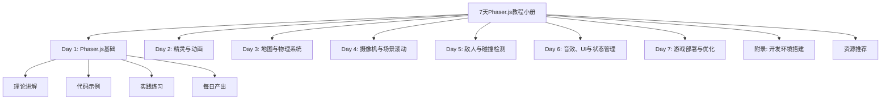
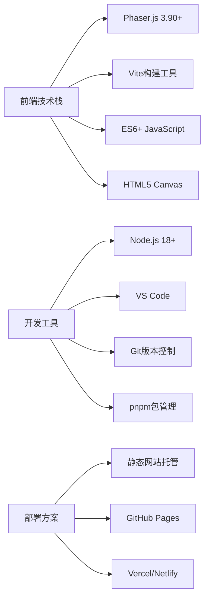
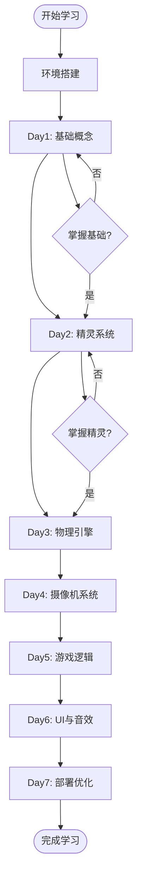

# 设计文档

## 概述

本设计文档详细描述了7天Phaser.js游戏开发教程小册的整体架构、内容组织方式、技术实现方案和学习路径设计。教程将采用渐进式教学方法，通过理论讲解、代码示例和实践项目相结合的方式，帮助学习者在7天内掌握Phaser.js游戏开发的核心技能。

## 架构

### 教程内容架构



### 技术架构



### 学习路径架构



## 组件和接口

### 教程内容组件

#### 1. 每日教程模块
- **理论讲解模块**: 核心概念介绍、API说明、最佳实践
- **代码示例模块**: 完整可运行的示例代码、注释详细
- **实践练习模块**: 循序渐进的练习题、挑战任务
- **项目构建模块**: 每日累积的游戏项目代码

#### 2. 代码示例结构
```javascript
// 标准的每日项目结构
project/
├── src/
│   ├── main.js          // 入口文件
│   ├── scenes/          // 游戏场景
│   ├── sprites/         // 精灵类
│   ├── utils/           // 工具函数
│   └── style/           // 样式文件
├── public/              // 静态资源
├── package.json         // 项目配置
└── index.html          // HTML模板
```

#### 3. 游戏开发接口设计

**场景管理接口**
```javascript
class GameScene extends Phaser.Scene {
    constructor() {
        super({ key: 'GameScene' });
    }
    
    preload() {
        // 资源加载
    }
    
    create() {
        // 场景创建
    }
    
    update() {
        // 游戏循环更新
    }
}
```

**精灵管理接口**
```javascript
class Player extends Phaser.Physics.Arcade.Sprite {
    constructor(scene, x, y) {
        super(scene, x, y, 'player');
        this.scene.add.existing(this);
        this.scene.physics.add.existing(this);
    }
    
    update() {
        // 玩家更新逻辑
    }
}
```

### 教程交付接口

#### 1. 在线阅读接口
- **内容渲染**: Markdown转HTML，支持代码高亮
- **导航系统**: 章节跳转、进度追踪
- **交互功能**: 代码复制、在线运行

#### 2. PDF生成接口
- **内容格式化**: 统一的PDF样式模板
- **代码格式**: 语法高亮、分页优化
- **图表处理**: Mermaid图表转换为图片

#### 3. 邮件课程接口
- **内容分发**: 每日定时发送对应章节
- **进度跟踪**: 学习进度统计和提醒
- **互动支持**: 问题反馈和答疑

## 数据模型

### 教程内容数据模型

```typescript
interface TutorialDay {
    day: number;
    title: string;
    description: string;
    objectives: string[];
    deliverables: string[];
    content: {
        theory: TheorySection[];
        examples: CodeExample[];
        exercises: Exercise[];
        project: ProjectStep[];
    };
    prerequisites: string[];
    nextSteps: string[];
}

interface TheorySection {
    title: string;
    content: string;
    concepts: Concept[];
    diagrams?: string[];
}

interface CodeExample {
    title: string;
    description: string;
    code: string;
    language: string;
    runnable: boolean;
    explanation: string[];
}

interface Exercise {
    title: string;
    description: string;
    difficulty: 'easy' | 'medium' | 'hard';
    hints: string[];
    solution?: string;
    validation?: string;
}

interface ProjectStep {
    step: number;
    title: string;
    description: string;
    code: string;
    files: ProjectFile[];
    testing: string[];
}
```

### 游戏项目数据模型

```typescript
interface GameProject {
    name: string;
    version: string;
    description: string;
    scenes: GameScene[];
    assets: GameAsset[];
    config: GameConfig;
}

interface GameScene {
    key: string;
    name: string;
    description: string;
    preloadAssets: string[];
    gameObjects: GameObject[];
    physics: PhysicsConfig;
}

interface GameAsset {
    key: string;
    type: 'image' | 'spritesheet' | 'audio' | 'json';
    path: string;
    config?: any;
}

interface GameObject {
    type: 'sprite' | 'text' | 'group';
    key: string;
    properties: any;
    behaviors: string[];
}
```

## 错误处理

### 学习过程错误处理

1. **环境搭建错误**
   - 提供详细的故障排除指南
   - 常见问题FAQ和解决方案
   - 替代方案和工具推荐

2. **代码运行错误**
   - 分步调试指导
   - 常见错误类型和修复方法
   - 浏览器开发者工具使用指南

3. **概念理解错误**
   - 提供多种解释方式
   - 视觉化图表和动画说明
   - 实际案例对比分析

### 技术实现错误处理

1. **Phaser.js API错误**
   - 版本兼容性检查
   - API变更说明和迁移指南
   - 替代实现方案

2. **浏览器兼容性错误**
   - 支持的浏览器列表
   - Polyfill和兼容性处理
   - 降级方案设计

3. **性能问题处理**
   - 性能监控和分析工具
   - 优化建议和最佳实践
   - 资源管理策略

## 测试策略

### 教程内容测试

1. **内容准确性测试**
   - 技术内容专家审核
   - 代码示例运行验证
   - 概念解释清晰度检查

2. **学习效果测试**
   - 目标用户试学反馈
   - 学习路径合理性验证
   - 难度梯度适配性测试

3. **多平台兼容性测试**
   - 不同操作系统环境测试
   - 各种浏览器兼容性验证
   - 移动端适配测试

### 代码项目测试

1. **功能测试**
   - 每日项目功能完整性
   - 游戏逻辑正确性验证
   - 用户交互响应测试

2. **性能测试**
   - 游戏运行性能监控
   - 资源加载效率测试
   - 内存使用优化验证

3. **跨平台测试**
   - 桌面浏览器兼容性
   - 移动设备适配测试
   - 不同屏幕分辨率支持

### 自动化测试

1. **内容构建测试**
   - Markdown渲染正确性
   - 代码高亮功能验证
   - 图表生成准确性

2. **项目构建测试**
   - Vite构建流程验证
   - 依赖包版本兼容性
   - 部署包完整性检查

3. **持续集成测试**
   - GitHub Actions自动化
   - 多环境部署验证
   - 回归测试自动执行

## 实现细节

### 第一天：Phaser.js基础
- **核心概念**: Game对象、Scene系统、游戏循环
- **基础API**: 场景创建、资源加载、基本渲染
- **实践项目**: 创建第一个可运行的Phaser游戏

### 第二天：精灵与动画
- **核心概念**: Sprite对象、纹理管理、动画系统
- **基础API**: 精灵创建、动画播放、用户输入处理
- **实践项目**: 可控制的角色精灵

### 第三天：地图与物理系统
- **核心概念**: Tilemap系统、物理引擎、碰撞检测
- **基础API**: 地图加载、物理体创建、碰撞处理
- **实践项目**: 带有地形碰撞的游戏世界

### 第四天：摄像机与场景滚动
- **核心概念**: Camera系统、世界坐标、视口管理
- **基础API**: 摄像机控制、跟随目标、边界限制
- **实践项目**: 卷轴滚动的游戏场景

### 第五天：敌人与碰撞检测
- **核心概念**: 游戏对象管理、AI行为、碰撞响应
- **基础API**: 对象组管理、碰撞检测、游戏状态
- **实践项目**: 带有敌人交互的游戏

### 第六天：音效、UI与状态管理
- **核心概念**: 音频系统、UI元素、游戏状态
- **基础API**: 音效播放、文本显示、状态切换
- **实践项目**: 完整的游戏体验

### 第七天：游戏部署与优化
- **核心概念**: 构建优化、性能调优、部署策略
- **基础API**: 资源优化、代码分割、错误处理
- **实践项目**: 可发布的完整游戏

### 技术选型理由

1. **Phaser.js 3.90+**: 
   - 成熟稳定的HTML5游戏引擎
   - 丰富的API和活跃的社区
   - 良好的文档和学习资源

2. **Vite构建工具**:
   - 快速的开发服务器
   - 现代化的构建流程
   - 优秀的开发体验

3. **ES6+ JavaScript**:
   - 现代JavaScript语法
   - 更好的代码组织能力
   - 与前端开发趋势一致

4. **渐进式教学方法**:
   - 符合认知学习规律
   - 降低学习门槛
   - 提高学习成功率