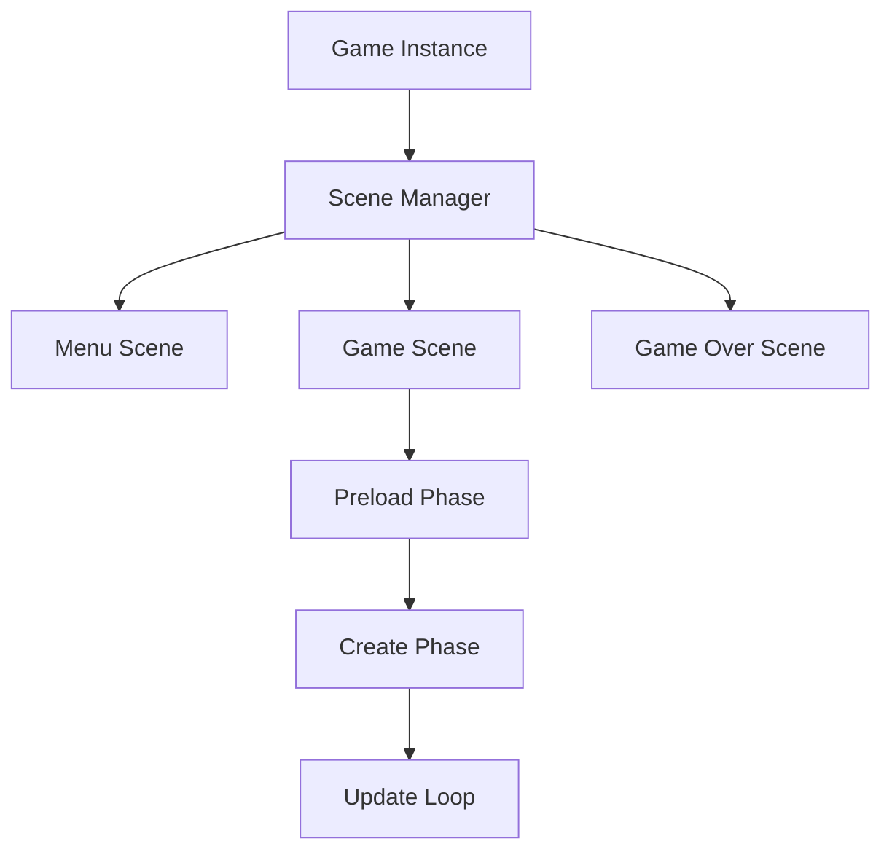
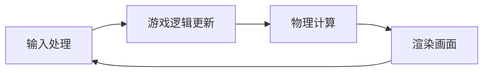

# Day 1: Phaser.js 基础入门

> 🎯 **今日目标**: 理解Phaser.js核心概念，创建第一个可运行的游戏场景
>
> ⏱️ **预计时间**: 2-3小时
>
> 📦 **今日产出**: 一个在浏览器中运行的基础游戏场景

---

## 📚 理论讲解

### 什么是 Phaser.js？

Phaser.js 是一个快速、免费且开源的 HTML5 游戏框架，专门用于创建 2D 游戏。它由 Richard Davey 在 2013 年创建，至今已经发展成为最受欢迎的 JavaScript 游戏引擎之一。

#### 🌟 Phaser.js 的核心优势

1. **易于学习**: 简洁的API设计，丰富的文档和示例
2. **功能强大**: 内置物理引擎、音频系统、输入处理等
3. **跨平台**: 支持桌面和移动设备浏览器
4. **活跃社区**: 大量的插件、教程和社区支持
5. **现代化**: 支持ES6+语法，与现代前端工具链完美集成

#### 🎮 适用场景

- **Web小游戏**: 休闲游戏、益智游戏、动作游戏
- **教育游戏**: 互动学习应用、儿童教育游戏
- **营销游戏**: 品牌推广、活动互动
- **原型开发**: 快速验证游戏创意和机制

### Phaser.js 核心概念

#### 1. 游戏实例 (Game Instance)

游戏实例是整个Phaser应用的根对象，负责管理游戏的生命周期、渲染器、场景等。

```javascript
const game = new Phaser.Game({
    type: Phaser.AUTO,        // 渲染器类型
    width: 800,               // 游戏宽度
    height: 600,              // 游戏高度
    parent: 'game',           // DOM容器ID
    scene: [GameScene]        // 游戏场景列表
});
```

#### 2. 场景系统 (Scene System)

场景是游戏的基本组织单位，类似于电影中的场景。每个场景都有自己的生命周期和管理的游戏对象。



**场景生命周期**:

- `preload()`: 资源加载阶段
- `create()`: 场景创建阶段
- `update()`: 游戏循环更新阶段

#### 3. 游戏循环 (Game Loop)

游戏循环是游戏引擎的心脏，负责持续更新游戏状态和渲染画面。



**典型的游戏循环包含**:

1. **输入处理**: 检测键盘、鼠标、触摸输入
2. **游戏逻辑**: 更新游戏对象状态、处理碰撞等
3. **物理计算**: 处理重力、速度、碰撞响应
4. **渲染**: 将游戏对象绘制到屏幕上

#### 4. 游戏对象 (Game Objects)

游戏对象是构成游戏世界的基本元素，包括精灵、文本、图形等。

**常用游戏对象类型**:

- **Sprite**: 精灵对象，用于显示图片
- **Text**: 文本对象，用于显示文字
- **Graphics**: 图形对象，用于绘制几何图形
- **Group**: 组对象，用于管理多个游戏对象

#### 5. 坐标系统

Phaser使用标准的2D坐标系统：

- **原点(0,0)**: 位于屏幕左上角
- **X轴**: 从左到右递增
- **Y轴**: 从上到下递增

```bash
(0,0) ────────────► X轴
  │
  │    (400,300)
  │       ●
  │
  ▼
 Y轴
```

### 开发环境和工具链

#### 现代化开发环境

我们使用现代化的前端开发工具链：

1. **Vite**: 快速的构建工具和开发服务器
2. **ES6+ Modules**: 模块化代码组织
3. **Hot Reload**: 代码修改后自动刷新
4. **Source Maps**: 便于调试的源码映射

#### 项目结构最佳实践

```bash
src/
├── main.js           # 游戏入口文件
├── scenes/           # 游戏场景目录
│   ├── LoadScene.js  # 加载场景
│   ├── MenuScene.js  # 菜单场景
│   └── GameScene.js  # 游戏场景
├── sprites/          # 游戏精灵类
├── utils/            # 工具函数
│   ├── constants.js  # 常量定义
│   └── helpers.js    # 辅助函数
└── styles/           # 样式文件
```

### API 核心概念

#### 配置对象 (Config Object)

游戏配置对象定义了游戏的基本参数：

```javascript
const config = {
    type: Phaser.AUTO,           // 渲染器类型 (AUTO/WEBGL/CANVAS)
    width: 800,                  // 游戏画布宽度
    height: 600,                 // 游戏画布高度
    parent: 'game',              // DOM容器元素ID
    backgroundColor: '#2c3e50',  // 背景颜色
    physics: {                   // 物理引擎配置
        default: 'arcade',
        arcade: {
            gravity: { y: 300 },
            debug: false
        }
    },
    scene: [LoadScene, GameScene] // 场景列表
};
```

#### 场景类结构

```javascript
class GameScene extends Phaser.Scene {
    constructor() {
        super({ key: 'game-scene' });
    }

    preload() {
        // 加载游戏资源
        this.load.image('player', 'assets/player.png');
    }

    create() {
        // 创建游戏对象
        this.player = this.add.sprite(400, 300, 'player');
    }

    update() {
        // 游戏循环更新
        // 这里处理游戏逻辑
    }
}
```

### 最佳实践指南

#### 1. 代码组织

- **单一职责**: 每个类只负责一个功能
- **模块化**: 使用ES6模块系统组织代码
- **常量管理**: 将魔法数字提取为常量

#### 2. 性能优化

- **对象池**: 重用游戏对象，避免频繁创建销毁
- **资源管理**: 合理加载和释放资源
- **渲染优化**: 避免不必要的重绘

#### 3. 调试技巧

- **浏览器开发者工具**: 使用Console、Network、Performance面板
- **Phaser调试模式**: 开启物理引擎调试显示
- **日志记录**: 合理使用console.log记录关键信息

---

## 🛠️ 实践环节

### 环境准备检查

在开始编码之前，请确保你的开发环境已经准备就绪：

#### 1. 检查Node.js版本

```bash
node --version  # 应该显示 v18.0.0 或更高版本
```

#### 2. 检查pnpm安装

```bash
pnpm --version  # 应该显示 8.0.0 或更高版本
```

#### 3. 初始化项目

```bash
# 在项目根目录运行
node project-template/setup-project.js 1_starter

# 进入项目目录
cd 1_starter/source

# 安装依赖
pnpm install
```

#### 4. 启动开发服务器

```bash
pnpm dev
```

如果一切正常，你应该能在浏览器中看到一个空白的游戏画布。

### 第一个Phaser游戏

现在让我们创建第一个真正的Phaser游戏！我们将创建一个简单的场景，包含一个可以移动的精灵。

#### 步骤1: 理解项目结构

查看 `src/main.js` 文件，这是游戏的入口点：

```javascript
// 这里将包含完整的游戏配置和启动代码
```

#### 步骤2: 创建基础场景

我们将创建一个简单的游戏场景，包含：

- 背景色设置
- 简单的几何图形
- 基本的用户交互

#### 步骤3: 添加交互功能

学习如何处理用户输入，让游戏对象响应键盘和鼠标操作。

---

## 🎯 今日练习

### 练习1: 基础场景创建 (⭐)

**目标**: 创建一个显示"Hello Phaser!"文本的场景

**要求**:

- 在屏幕中央显示文本
- 设置合适的字体和颜色
- 添加背景色

**提示**:

```javascript
// 在create()方法中添加文本
this.add.text(400, 300, 'Hello Phaser!', {
    fontSize: '32px',
    fill: '#ffffff'
}).setOrigin(0.5);
```

### 练习2: 几何图形绘制 (⭐⭐)

**目标**: 使用Graphics对象绘制基本图形

**要求**:

- 绘制一个圆形
- 绘制一个矩形
- 设置不同的颜色和边框

**提示**:

```javascript
// 创建Graphics对象
const graphics = this.add.graphics();

// 绘制填充圆形
graphics.fillStyle(0xff0000);
graphics.fillCircle(200, 200, 50);
```

### 练习3: 鼠标交互 (⭐⭐⭐)

**目标**: 实现鼠标点击改变图形颜色

**要求**:

- 创建一个可点击的图形
- 点击时改变颜色
- 添加鼠标悬停效果

**挑战**: 尝试添加多个可交互的对象

---

## 🔍 常见问题解答

### Q1: 游戏画布显示不出来怎么办？

**A**: 检查以下几点：

1. HTML中的容器元素ID是否正确
2. 浏览器控制台是否有错误信息
3. 开发服务器是否正常启动
4. 端口是否被占用

### Q2: 如何调试Phaser游戏？

**A**: 推荐的调试方法：

1. 使用浏览器开发者工具的Console面板
2. 在代码中添加`console.log()`输出关键信息
3. 使用`debugger;`语句设置断点
4. 开启Phaser的调试模式查看物理边界

### Q3: 游戏性能不好怎么优化？

**A**: 基础优化建议：

1. 避免在update()中创建新对象
2. 使用对象池管理频繁创建的对象
3. 合理设置游戏帧率
4. 优化图片资源大小和格式

### Q4: 如何处理不同屏幕尺寸？

**A**: 响应式设计方案：

1. 使用相对单位而不是固定像素
2. 实现游戏画布的自适应缩放
3. 为移动设备优化触摸控制
4. 考虑横屏和竖屏模式

---

## 📖 延伸阅读

### 官方资源

- [Phaser.js 官方网站](https://phaser.io/)
- [Phaser.js API 文档](https://photonstorm.github.io/phaser3-docs/)
- [Phaser.js 官方示例](https://phaser.io/examples)

### 社区资源

- [Phaser World 新闻周刊](https://phaser.io/community/newsletter)
- [HTML5 Game Devs 论坛](https://www.html5gamedevs.com/forum/14-phaser/)
- [Phaser Discord 社区](https://discord.gg/phaser)

### 学习资源

- [MDN Web Docs - Canvas API](https://developer.mozilla.org/en-US/docs/Web/API/Canvas_API)
- [JavaScript.info - 现代JavaScript教程](https://javascript.info/)
- [Game Programming Patterns](https://gameprogrammingpatterns.com/)

---

## 🎉 今日总结

恭喜你完成了Phaser.js的第一天学习！今天你学到了：

### ✅ 核心概念

- Phaser.js的基本架构和优势
- 游戏循环和场景系统的工作原理
- 坐标系统和游戏对象的概念

### ✅ 实践技能

- 搭建现代化的游戏开发环境
- 创建第一个Phaser游戏实例
- 理解项目结构和代码组织方式

### ✅ 开发工具

- 掌握Vite开发服务器的使用
- 学会使用浏览器开发者工具调试
- 了解现代JavaScript模块系统

### 🚀 明天预告

明天我们将学习：

- **精灵系统**: 如何加载和显示图片
- **动画系统**: 创建流畅的角色动画
- **用户输入**: 处理键盘和鼠标控制
- **实践项目**: 创建一个可控制的游戏角色

准备好迎接更有趣的挑战了吗？让我们继续这段游戏开发之旅！

---

> 💡 **学习提示**: 不要急于求成，确保理解每个概念后再继续。游戏开发是一个循序渐进的过程，扎实的基础会让后续学习更加顺利。
>
> 🤝 **交流讨论**: 如果遇到问题，欢迎在社区中提问交流。记住，每个游戏开发者都是从第一行代码开始的！
