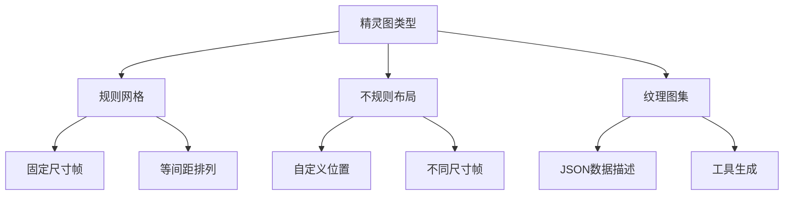
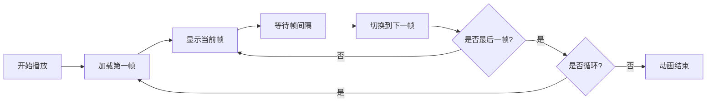

# Day 2: 精灵与动画系统

> 🎯 **今日目标**: 掌握精灵系统和动画创建，实现可控制的角色精灵
>
> ⏱️ **预计时间**: 2-3 小时
>
> 📦 **今日产出**: 一个带有动画效果的可控制角色

---

## 📚 理论讲解

### 什么是精灵 (Sprite)？

精灵是游戏开发中最重要的概念之一，它是一个可以在屏幕上显示和操作的 2D 图像对象。在 Phaser.js 中，精灵不仅可以显示静态图片，还可以播放动画、响应用户输入、参与物理模拟等。

#### 🌟 精灵的核心特性

1. **图像显示**: 显示单张图片或精灵图中的一帧
2. **变换操作**: 位置、旋转、缩放、透明度等
3. **动画播放**: 通过切换帧来创建动画效果
4. **交互响应**: 可以响应鼠标、键盘等输入
5. **物理属性**: 可以参与碰撞检测和物理模拟

#### 🎮 精灵的应用场景

- **角色精灵**: 玩家控制的主角、NPC 角色
- **道具精灵**: 收集品、武器、装备等
- **环境精灵**: 背景元素、装饰物、特效
- **UI 精灵**: 按钮、图标、界面元素

### 精灵图 (Sprite Sheet) 系统

精灵图是将多个相关图像组合在一张大图中的技术，这样做有很多优势：

#### 📊 精灵图的优势

1. **性能优化**: 减少 HTTP 请求次数
2. **内存效率**: 更好的纹理管理
3. **加载速度**: 一次加载多个帧
4. **组织便利**: 相关图像集中管理

#### 🗂️ 精灵图的类型



**规则网格精灵图**:

```
[帧1][帧2][帧3][帧4]
[帧5][帧6][帧7][帧8]
[帧9][帧10][帧11][帧12]
```

**纹理图集 (Texture Atlas)**:

```json
{
  "frames": {
    "player_idle_01.png": {
      "frame": { "x": 0, "y": 0, "w": 32, "h": 32 },
      "sourceSize": { "w": 32, "h": 32 }
    },
    "player_walk_01.png": {
      "frame": { "x": 32, "y": 0, "w": 32, "h": 32 },
      "sourceSize": { "w": 32, "h": 32 }
    }
  }
}
```

### 动画系统原理

游戏动画的本质是快速切换静态图像来创造运动的错觉，这个原理被称为"视觉暂留"。

#### 🎬 动画的基本概念

1. **帧 (Frame)**: 动画中的单个静态图像
2. **帧率 (Frame Rate)**: 每秒播放的帧数 (FPS)
3. **关键帧 (Key Frame)**: 动画中的重要帧
4. **补间 (Tween)**: 关键帧之间的过渡

#### ⚡ 动画播放流程



#### 🎨 常见动画类型

- **循环动画**: 无限重复播放 (如角色待机)
- **单次动画**: 播放一次后停止 (如攻击动作)
- **往返动画**: 正向播放后反向播放 (如呼吸效果)
- **随机动画**: 随机选择帧播放 (如闪烁效果)

### Phaser.js 精灵系统

#### 精灵对象的创建

```javascript
// 方法1: 使用单张图片
const sprite = this.add.sprite(x, y, "texture-key");

// 方法2: 使用精灵图的特定帧
const sprite = this.add.sprite(x, y, "spritesheet-key", frameIndex);

// 方法3: 使用纹理图集
const sprite = this.add.sprite(x, y, "atlas-key", "frame-name");
```

#### 精灵属性和方法

```javascript
// 基本属性
sprite.x = 100; // X坐标
sprite.y = 200; // Y坐标
sprite.rotation = 0.5; // 旋转角度 (弧度)
sprite.scaleX = 1.5; // X轴缩放
sprite.scaleY = 1.5; // Y轴缩放
sprite.alpha = 0.8; // 透明度 (0-1)
sprite.visible = true; // 是否可见

// 便捷方法
sprite.setPosition(x, y); // 设置位置
sprite.setScale(scale); // 设置缩放
sprite.setRotation(angle); // 设置旋转
sprite.setAlpha(alpha); // 设置透明度
sprite.setOrigin(x, y); // 设置锚点 (0-1)
sprite.setTint(color); // 设置色调
```

#### 动画配置和播放

```javascript
// 创建动画配置
this.anims.create({
  key: "player-walk", // 动画键名
  frames: this.anims.generateFrameNumbers("player", {
    start: 0,
    end: 7,
  }), // 帧序列
  frameRate: 10, // 帧率
  repeat: -1, // 重复次数 (-1为无限)
});

// 播放动画
sprite.play("player-walk");

// 动画控制
sprite.anims.pause(); // 暂停
sprite.anims.resume(); // 恢复
sprite.anims.stop(); // 停止
sprite.anims.restart(); // 重新开始
```

### 用户输入处理进阶

#### 键盘输入系统

```javascript
// 创建输入对象
this.cursors = this.input.keyboard.createCursorKeys();
this.wasd = this.input.keyboard.addKeys("W,S,A,D");

// 单个按键
this.spaceKey = this.input.keyboard.addKey("SPACE");

// 检查按键状态
if (this.cursors.left.isDown) {
  // 按键被按下
}

if (this.cursors.left.isUp) {
  // 按键未被按下
}

// 按键事件
this.spaceKey.on("down", () => {
  // 按键按下时触发
});

this.spaceKey.on("up", () => {
  // 按键释放时触发
});
```

#### 鼠标和触摸输入

```javascript
// 鼠标输入
this.input.on("pointerdown", (pointer) => {
  console.log("鼠标点击:", pointer.x, pointer.y);
});

this.input.on("pointermove", (pointer) => {
  console.log("鼠标移动:", pointer.x, pointer.y);
});

// 精灵交互
sprite.setInteractive();
sprite.on("pointerdown", () => {
  console.log("精灵被点击");
});
```

### 纹理管理和优化

#### 纹理加载策略

```javascript
preload() {
    // 加载单张图片
    this.load.image('background', 'assets/background.png');

    // 加载精灵图
    this.load.spritesheet('player', 'assets/player.png', {
        frameWidth: 32,
        frameHeight: 32
    });

    // 加载纹理图集
    this.load.atlas('characters', 'assets/characters.png', 'assets/characters.json');

    // 设置加载进度
    this.load.on('progress', (value) => {
        console.log('加载进度:', Math.round(value * 100) + '%');
    });
}
```

#### 内存管理

```javascript
// 销毁不需要的精灵
sprite.destroy();

// 清理纹理缓存
this.textures.remove("unused-texture");

// 检查纹理使用情况
console.log("纹理列表:", this.textures.list);
```

### 性能优化技巧

#### 1. 对象池 (Object Pooling)

```javascript
class BulletPool {
  constructor(scene, size = 20) {
    this.scene = scene;
    this.pool = [];

    // 预创建对象
    for (let i = 0; i < size; i++) {
      const bullet = scene.add.sprite(0, 0, "bullet");
      bullet.setVisible(false);
      bullet.setActive(false);
      this.pool.push(bullet);
    }
  }

  get() {
    // 获取可用对象
    for (let bullet of this.pool) {
      if (!bullet.active) {
        bullet.setVisible(true);
        bullet.setActive(true);
        return bullet;
      }
    }
    return null;
  }

  release(bullet) {
    // 释放对象回池中
    bullet.setVisible(false);
    bullet.setActive(false);
  }
}
```

#### 2. 批量渲染

```javascript
// 使用Group管理大量相似对象
this.enemies = this.add.group();

// 批量更新
this.enemies.children.entries.forEach((enemy) => {
  enemy.update();
});
```

#### 3. 视口剔除

```javascript
update() {
    // 只更新屏幕内的对象
    this.enemies.children.entries.forEach(enemy => {
        if (this.cameras.main.worldView.contains(enemy.x, enemy.y)) {
            enemy.update();
        }
    });
}
```

---

## 🛠️ 实践环节

### 环境准备

确保你已经完成了 Day 1 的环境搭建，如果还没有，请先完成以下步骤：

```bash
# 初始化Day 2项目
node project-template/setup-project.js 2_sprite

# 进入项目目录
cd 2_sprite/source

# 安装依赖
pnpm install

# 启动开发服务器
pnpm dev
```

### 创建第一个精灵

让我们从最简单的精灵开始：

#### 步骤 1: 加载图片资源

```javascript
preload() {
    // 我们先使用程序生成的纹理，不需要外部图片
    this.createPlayerTexture();
}

createPlayerTexture() {
    // 创建一个简单的角色纹理
    this.add.graphics()
        .fillStyle(0x4ecdc4)
        .fillCircle(16, 16, 14)
        .lineStyle(2, 0xffffff)
        .strokeCircle(16, 16, 14)
        .generateTexture('player', 32, 32);
}
```

#### 步骤 2: 创建精灵对象

```javascript
create() {
    // 创建玩家精灵
    this.player = this.add.sprite(400, 300, 'player');
    this.player.setScale(1.5);
}
```

#### 步骤 3: 添加基本控制

```javascript
create() {
    // ... 精灵创建代码 ...

    // 设置输入
    this.cursors = this.input.keyboard.createCursorKeys();
}

update() {
    // 处理移动
    if (this.cursors.left.isDown) {
        this.player.x -= 200 * (this.game.loop.delta / 1000);
    }
    if (this.cursors.right.isDown) {
        this.player.x += 200 * (this.game.loop.delta / 1000);
    }
    if (this.cursors.up.isDown) {
        this.player.y -= 200 * (this.game.loop.delta / 1000);
    }
    if (this.cursors.down.isDown) {
        this.player.y += 200 * (this.game.loop.delta / 1000);
    }
}
```

### 创建精灵图动画

现在让我们创建一个更复杂的例子，包含动画：

#### 步骤 1: 创建精灵图纹理

```javascript
createAnimatedTextures() {
    // 创建行走动画帧
    const walkFrames = [];
    for (let i = 0; i < 4; i++) {
        const graphics = this.add.graphics();

        // 根据帧数改变颜色
        const colors = [0x4ecdc4, 0x45b7d1, 0x96ceb4, 0x6c5ce7];
        graphics.fillStyle(colors[i]);
        graphics.fillCircle(16, 16, 14);

        // 添加方向指示
        graphics.fillStyle(0xffffff);
        graphics.fillCircle(20, 16, 3);

        graphics.generateTexture(`player-walk-${i}`, 32, 32);
        walkFrames.push({ key: `player-walk-${i}` });
    }

    return walkFrames;
}
```

#### 步骤 2: 创建动画配置

```javascript
create() {
    // 创建纹理
    const walkFrames = this.createAnimatedTextures();

    // 创建动画
    this.anims.create({
        key: 'player-walk',
        frames: walkFrames,
        frameRate: 8,
        repeat: -1
    });

    // 创建精灵
    this.player = this.add.sprite(400, 300, 'player-walk-0');
    this.player.setScale(1.5);
}
```

#### 步骤 3: 根据输入播放动画

```javascript
update() {
    let isMoving = false;

    if (this.cursors.left.isDown) {
        this.player.x -= 200 * (this.game.loop.delta / 1000);
        this.player.setFlipX(true);
        isMoving = true;
    }
    if (this.cursors.right.isDown) {
        this.player.x += 200 * (this.game.loop.delta / 1000);
        this.player.setFlipX(false);
        isMoving = true;
    }
    if (this.cursors.up.isDown) {
        this.player.y -= 200 * (this.game.loop.delta / 1000);
        isMoving = true;
    }
    if (this.cursors.down.isDown) {
        this.player.y += 200 * (this.game.loop.delta / 1000);
        isMoving = true;
    }

    // 根据移动状态播放动画
    if (isMoving) {
        if (!this.player.anims.isPlaying || this.player.anims.currentAnim.key !== 'player-walk') {
            this.player.play('player-walk');
        }
    } else {
        this.player.anims.stop();
        this.player.setFrame(0);
    }
}
```

---

## 🎯 今日练习

### 练习 1: 基础精灵控制 ⭐

**目标**: 创建一个可以用键盘控制的精灵

**要求**:

1. 创建一个彩色方块精灵
2. 使用方向键控制移动
3. 添加边界限制
4. 显示当前位置信息

**提示**:

```javascript
// 边界检查
this.player.x = Phaser.Math.Clamp(this.player.x, 0, 800);
this.player.y = Phaser.Math.Clamp(this.player.y, 0, 600);
```

### 练习 2: 精灵动画系统 ⭐⭐

**目标**: 实现一个带有多种动画状态的角色

**要求**:

1. 创建待机动画 (缓慢呼吸效果)
2. 创建移动动画 (行走循环)
3. 根据输入状态切换动画
4. 添加方向翻转效果

**提示**:

```javascript
// 创建呼吸动画
this.tweens.add({
  targets: sprite,
  scaleX: 1.1,
  scaleY: 1.1,
  duration: 1000,
  yoyo: true,
  repeat: -1,
});
```

### 练习 3: 多精灵管理 ⭐⭐⭐

**目标**: 创建一个精灵管理系统

**要求**:

1. 创建多个不同类型的精灵
2. 实现精灵的生成和销毁
3. 添加精灵之间的交互
4. 实现简单的 AI 行为

**挑战**: 实现精灵的自动寻路和避障

---

## 🔍 常见问题解答

### Q1: 动画播放不流畅怎么办？

**A**: 检查以下几点：

1. 帧率设置是否合适 (建议 8-12fps)
2. 精灵图的帧是否连贯
3. 游戏整体帧率是否稳定
4. 是否有性能瓶颈

### Q2: 如何制作自己的精灵图？

**A**: 推荐工具：

1. **免费工具**: GIMP, Piskel, Aseprite
2. **在线工具**: Pixilart, Lospec Pixel Editor
3. **专业工具**: Photoshop, Spine, DragonBones

### Q3: 精灵图的尺寸应该如何设计？

**A**: 设计建议：

1. 使用 2 的幂次方尺寸 (32x32, 64x64, 128x128)
2. 保持帧尺寸一致
3. 考虑目标分辨率和缩放需求
4. 预留适当的边距避免渗色

### Q4: 如何优化大量精灵的性能？

**A**: 优化策略：

1. 使用对象池管理精灵
2. 实现视口剔除
3. 合并相似的精灵到精灵图中
4. 避免频繁的创建和销毁

---

## 📖 延伸阅读

### 动画制作资源

- [Piskel - 免费像素艺术编辑器](https://www.piskelapp.com/)
- [OpenGameArt - 免费游戏素材](https://opengameart.org/)
- [itch.io - 独立游戏素材](https://itch.io/game-assets)

### 技术文档

- [Phaser 3 Sprite 文档](https://photonstorm.github.io/phaser3-docs/Phaser.GameObjects.Sprite.html)
- [Phaser 3 Animation 文档](https://photonstorm.github.io/phaser3-docs/Phaser.Animations.AnimationManager.html)

### 学习教程

- [2D 游戏动画原理](https://www.gamasutra.com/view/feature/131241/animation_in_games_methods_and_.php)
- [精灵图优化指南](https://developer.mozilla.org/en-US/docs/Web/Guide/CSS/CSS_Image_Sprites)

---

## 🎉 今日总结

恭喜你完成了 Phaser.js 的第二天学习！今天你学到了：

### ✅ 核心概念

- 精灵系统的工作原理和应用
- 精灵图的组织和使用方法
- 动画系统的基本原理
- 用户输入处理的进阶技巧

### ✅ 实践技能

- 创建和管理精灵对象
- 实现流畅的角色动画
- 处理复杂的用户输入
- 优化精灵性能和内存使用

### ✅ 开发工具

- 掌握动画配置和播放
- 学会纹理管理和优化
- 了解性能监控和调试
- 理解对象池等优化技术

### 🚀 明天预告

明天我们将学习：

- **Tilemap 系统**: 创建游戏世界和关卡
- **物理引擎**: 实现重力、碰撞和物理交互
- **碰撞检测**: 精确的碰撞判断和响应
- **实践项目**: 制作一个平台跳跃游戏

你已经掌握了游戏开发的重要基础，继续加油！🎮

---

> 💡 **学习提示**: 精灵和动画是游戏开发的核心，多练习不同类型的动画效果，尝试创作自己的角色和动画。
>
> 🎨 **创意建议**: 可以尝试制作不同风格的角色，如像素风、卡通风或写实风格，体验不同的视觉效果。
