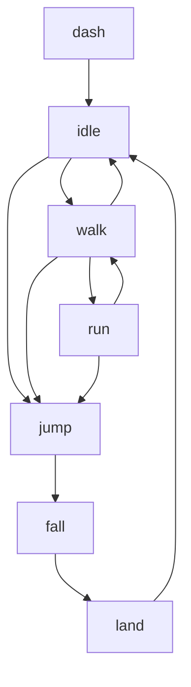

# Day 2 项目指南 - 精灵与动画系统

> 🎯 这个指南将帮助你深入理解和使用Day 2的精灵与动画系统

---

## 📁 项目结构

```
2_sprite/source/
├── src/
│   ├── scenes/
│   │   └── GameScene.js      # 主游戏场景
│   ├── sprites/
│   │   └── Player.js         # 玩家角色类
│   ├── utils/
│   │   ├── constants.js      # 游戏常量定义
│   │   └── helpers.js        # 工具函数库
│   ├── style/
│   │   └── index.css         # 样式文件
│   └── main.js               # 游戏入口文件
├── public/                   # 静态资源目录
├── EXERCISES.md              # 练习题集合
├── PROJECT_GUIDE.md          # 项目指南 (本文件)
├── package.json              # 项目配置
└── index.html                # HTML模板
```

---

## 🚀 快速开始

### 1. 环境准备
```bash
# 初始化Day 2项目
node project-template/setup-project.js 2_sprite

# 进入项目目录
cd 2_sprite/source

# 安装依赖
pnpm install
```

### 2. 启动开发服务器
```bash
pnpm dev
```

### 3. 在浏览器中访问
打开 http://localhost:3000 体验精灵与动画系统

---

## 🎮 核心功能介绍

### Player.js - 高级角色系统
这是一个完整的角色控制系统，展示了精灵系统的高级用法：

**核心特性:**
- ✅ 多状态动画系统 (待机/行走/跑步/跳跃/下落/着陆/冲刺)
- ✅ 高级输入处理 (输入缓冲、土狼时间)
- ✅ 物理属性管理 (重力、摩擦力、最大速度)
- ✅ 视觉效果集成 (粒子系统、屏幕震动)
- ✅ 状态机实现 (流畅的状态切换)

**操作方式:**
- 方向键或WASD: 移动角色
- 上键: 跳跃 (支持二段跳)
- Shift键: 冲刺
- R键: 重置游戏

**学习重点:**
- 理解复杂的角色状态管理
- 掌握输入缓冲和响应优化
- 学会粒子系统的集成使用
- 了解性能优化的实践

### GameScene.js - 完整游戏场景
这个场景展示了如何组织一个完整的游戏世界：

**功能特性:**
- ✅ 程序化精灵图生成
- ✅ 多层背景系统 (云朵、远山、渐变)
- ✅ 平台系统和碰撞检测
- ✅ 粒子效果管理
- ✅ UI系统和状态显示
- ✅ 摄像机跟随系统

**技术亮点:**
- 动态纹理生成技术
- 复杂的动画状态切换
- 粒子系统的高级应用
- 性能监控和优化

---

## 🎨 精灵图系统详解

### 程序化精灵图生成
项目中使用了程序化生成精灵图的技术，这样做的优势：

1. **无需外部资源**: 不依赖图片文件
2. **动态生成**: 可以根据需要生成不同的帧
3. **易于修改**: 通过代码调整视觉效果
4. **学习友好**: 便于理解精灵图的结构

### 精灵图创建流程

```javascript
// 1. 创建图形对象
const graphics = this.add.graphics();

// 2. 绘制内容
graphics.fillStyle(0x4ecdc4);
graphics.fillCircle(16, 16, 14);

// 3. 生成纹理
graphics.generateTexture('sprite-name', 32, 32);

// 4. 创建精灵图
const spriteSheet = this.add.renderTexture(0, 0, width, height);
for (let i = 0; i < frames; i++) {
    spriteSheet.draw(`frame-${i}`, i * frameWidth, 0);
}
spriteSheet.saveTexture('spritesheet-name');
```

### 动画配置最佳实践

```javascript
// 创建动画配置
this.anims.create({
    key: 'animation-name',           // 动画键名
    frames: this.anims.generateFrameNumbers('spritesheet', { 
        start: 0, end: 7 
    }),                              // 帧序列
    frameRate: 12,                   // 帧率 (建议8-15)
    repeat: -1,                      // 重复次数 (-1为无限)
    yoyo: false                      // 是否往返播放
});

// 播放动画
sprite.play('animation-name');

// 动画事件
sprite.on('animationcomplete', () => {
    // 动画完成时的处理
});
```

---

## 🎭 动画状态机系统

### 状态机设计原理

项目中的Player类实现了一个完整的状态机系统：



### 状态切换逻辑

```javascript
updateState() {
    this.previousState = this.currentState;
    
    // 状态判断逻辑
    if (!this.isGrounded) {
        if (this.body.velocity.y < -50) {
            this.currentState = 'jump';
        } else if (this.body.velocity.y > 50) {
            this.currentState = 'fall';
        }
    } else {
        if (this.isMoving) {
            const speed = Math.abs(this.body.velocity.x);
            if (speed > this.speed * 0.7) {
                this.currentState = 'run';
            } else {
                this.currentState = 'walk';
            }
        } else {
            this.currentState = 'idle';
        }
    }
    
    // 只在状态改变时切换动画
    if (this.currentState !== this.previousState) {
        this.play(`player-${this.currentState}`);
    }
}
```

### 输入缓冲系统

```javascript
// 输入缓冲的实现
handleJumpInput(cursors) {
    // 检查跳跃输入
    if (cursors.up.isDown && !cursors.up.wasDown) {
        this.inputBuffer.jump = PLAYER_CONFIG.INPUT_BUFFER_TIME;
    }
    
    // 执行跳跃
    if (this.inputBuffer.jump > 0) {
        if (this.isGrounded) {
            this.jump();
            this.inputBuffer.jump = 0;
        } else if (this.canDoubleJump && !this.doubleJumpUsed) {
            this.doubleJump();
            this.inputBuffer.jump = 0;
        }
    }
}
```

---

## ✨ 粒子系统详解

### 粒子效果类型

项目中实现了多种粒子效果：

1. **跳跃粒子**: 角色跳跃时的视觉反馈
2. **二段跳粒子**: 更强烈的特效表现
3. **着陆粒子**: 着陆时的尘土效果
4. **收集粒子**: 收集物品时的爆炸效果

### 粒子系统配置

```javascript
// 创建粒子发射器
this.jumpParticles = this.add.particles(0, 0, 'jump-particle', {
    speed: { min: 50, max: 100 },    // 速度范围
    scale: { start: 0.8, end: 0 },   // 缩放变化
    lifespan: 400,                   // 生命周期
    quantity: 5,                     // 发射数量
    emitting: false                  // 默认不发射
});

// 发射粒子
this.jumpParticles.emitParticleAt(x, y);
```

### 粒子效果优化

```javascript
// 粒子池管理
class ParticlePool {
    constructor(scene, maxSize = 100) {
        this.scene = scene;
        this.pool = [];
        this.active = [];
        this.maxSize = maxSize;
    }
    
    get() {
        if (this.pool.length > 0) {
            const particle = this.pool.pop();
            this.active.push(particle);
            return particle;
        }
        
        if (this.active.length < this.maxSize) {
            const particle = this.createParticle();
            this.active.push(particle);
            return particle;
        }
        
        return null;
    }
    
    release(particle) {
        const index = this.active.indexOf(particle);
        if (index > -1) {
            this.active.splice(index, 1);
            this.pool.push(particle);
            particle.setVisible(false);
        }
    }
}
```

---

## 🔧 性能优化技巧

### 1. 对象池管理

```javascript
// 子弹对象池示例
class BulletPool {
    constructor(scene, size = 20) {
        this.scene = scene;
        this.pool = [];
        
        // 预创建对象
        for (let i = 0; i < size; i++) {
            const bullet = scene.add.sprite(0, 0, 'bullet');
            bullet.setVisible(false);
            bullet.setActive(false);
            this.pool.push(bullet);
        }
    }
    
    getBullet() {
        for (let bullet of this.pool) {
            if (!bullet.active) {
                bullet.setVisible(true);
                bullet.setActive(true);
                return bullet;
            }
        }
        return null;
    }
    
    releaseBullet(bullet) {
        bullet.setVisible(false);
        bullet.setActive(false);
    }
}
```

### 2. 视口剔除

```javascript
update() {
    // 只更新屏幕内的对象
    this.enemies.children.entries.forEach(enemy => {
        if (this.cameras.main.worldView.contains(enemy.x, enemy.y)) {
            enemy.update();
        }
    });
}
```

### 3. 动画优化

```javascript
// 避免重复播放相同动画
if (!this.sprite.anims.isPlaying || 
    this.sprite.anims.currentAnim.key !== animationKey) {
    this.sprite.play(animationKey);
}

// 使用动画缓存
if (!this.anims.exists(animationKey)) {
    this.anims.create(animationConfig);
}
```

### 4. 内存管理

```javascript
// 及时清理不需要的资源
destroy() {
    // 清理粒子效果
    this.particles.forEach(particle => {
        if (particle && particle.destroy) {
            particle.destroy();
        }
    });
    
    // 清理动画
    this.anims.remove('player-animations');
    
    // 调用父类销毁
    super.destroy();
}
```

---

## 🎯 学习路径建议

### 初学者路径
1. **理解基础概念**: 精灵、动画、帧的概念
2. **创建简单精灵**: 使用单张图片创建精灵
3. **添加基本动画**: 创建简单的循环动画
4. **处理用户输入**: 让精灵响应键盘输入

### 进阶路径
1. **精灵图系统**: 学会创建和使用精灵图
2. **状态机设计**: 实现复杂的动画状态切换
3. **粒子系统**: 添加视觉特效
4. **性能优化**: 学会监控和优化性能

### 高级路径
1. **自定义动画系统**: 创建自己的动画管理器
2. **高级状态机**: 实现条件转换和优先级
3. **粒子编辑器**: 创建可视化的粒子编辑工具
4. **动画工具链**: 集成外部动画工具

---

## 🐛 常见问题解决

### Q: 动画播放不流畅
**A**: 检查以下几点：
1. 帧率设置是否合适 (建议8-15fps)
2. 精灵图的帧是否连贯
3. 是否有性能瓶颈
4. 动画切换是否过于频繁

### Q: 精灵图显示异常
**A**: 可能的原因：
1. 帧尺寸设置错误
2. 精灵图路径不正确
3. 纹理生成失败
4. 内存不足

### Q: 粒子效果性能差
**A**: 优化建议：
1. 减少同时存在的粒子数量
2. 使用对象池管理粒子
3. 及时清理不需要的粒子
4. 优化粒子纹理大小

### Q: 状态机切换异常
**A**: 检查要点：
1. 状态转换条件是否正确
2. 动画键名是否匹配
3. 状态优先级设置
4. 是否有死循环

---

## 📖 扩展学习资源

### 动画制作工具
- [Aseprite](https://www.aseprite.org/) - 专业像素艺术工具
- [Piskel](https://www.piskelapp.com/) - 免费在线像素编辑器
- [TexturePacker](https://www.codeandweb.com/texturepacker) - 精灵图打包工具

### 学习资源
- [12 Principles of Animation](https://en.wikipedia.org/wiki/Twelve_basic_principles_of_animation) - 动画基本原理
- [Phaser 3 Animation Examples](https://phaser.io/examples/v3.60.0/animation) - 官方动画示例
- [Game Programming Patterns - State](https://gameprogrammingpatterns.com/state.html) - 状态模式详解

### 社区资源
- [OpenGameArt](https://opengameart.org/) - 免费游戏素材
- [itch.io Game Assets](https://itch.io/game-assets) - 独立游戏素材
- [Kenney Assets](https://kenney.nl/assets) - 高质量免费素材

---

## 🎉 项目总结

通过Day 2的学习，你已经掌握了：

### ✅ 核心技能
- 精灵系统的深入使用
- 复杂动画状态机的实现
- 粒子系统的集成应用
- 高级输入处理技巧
- 性能监控和优化

### ✅ 实践经验
- 程序化资源生成
- 复杂游戏对象的设计
- 视觉效果的制作
- 代码架构的组织
- 调试和优化技巧

### ✅ 开发工具
- 动画配置和管理
- 粒子系统设计
- 状态机实现
- 性能分析工具
- 资源管理策略

### 🚀 下一步

明天我们将学习：
- **Tilemap系统**: 创建复杂的游戏世界
- **物理引擎**: 深入理解碰撞和物理模拟
- **关卡设计**: 设计有趣的游戏关卡
- **实践项目**: 制作一个完整的平台跳跃游戏

你已经具备了制作精美游戏角色的能力，继续加油！🎨

---

> 💡 **学习提示**: 精灵和动画是游戏视觉表现的核心，多实验不同的效果组合，培养良好的视觉设计感觉。
> 
> 🎨 **创意建议**: 尝试制作不同风格的角色和效果，如像素风、卡通风或科幻风格，体验不同的视觉表现力。