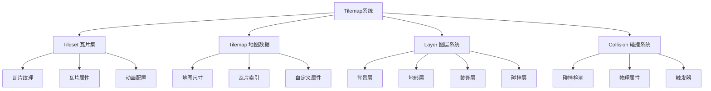
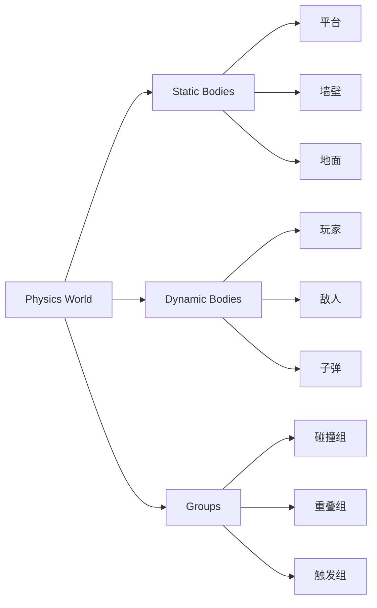
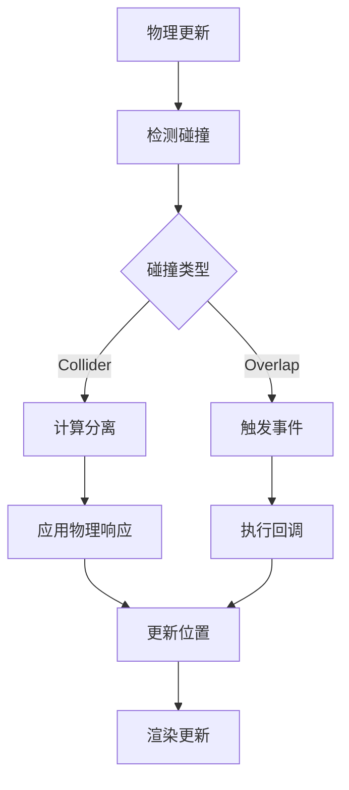

# Day 3: 地图与物理系统

> 🎯 **今日目标**: 掌握Tilemap系统和物理引擎，创建带有地形碰撞的游戏世界
> 
> ⏱️ **预计时间**: 3-4小时
> 
> 📦 **今日产出**: 一个完整的平台跳跃游戏世界

---

## 📚 理论讲解

### 什么是Tilemap系统？

Tilemap（瓦片地图）是游戏开发中用于构建游戏世界的重要技术。它将游戏世界划分为规则的网格，每个网格单元称为一个"瓦片"（Tile），通过组合不同的瓦片来构建复杂的游戏场景。

#### 🌟 Tilemap的核心优势

1. **内存效率**: 重复使用相同的瓦片纹理，大幅减少内存占用
2. **开发效率**: 通过可视化编辑器快速构建关卡
3. **性能优化**: 批量渲染相同纹理的瓦片，提升渲染性能
4. **易于编辑**: 支持层级管理、碰撞设置、属性配置等
5. **灵活扩展**: 支持动画瓦片、交互瓦片、特殊属性等

#### 🎮 Tilemap的应用场景

- **平台跳跃游戏**: 地形、平台、障碍物
- **RPG游戏**: 世界地图、城镇、地牢
- **策略游戏**: 战场地形、资源分布
- **解谜游戏**: 关卡布局、机关设置

### Tilemap系统架构



### 瓦片集（Tileset）详解

瓦片集是包含所有瓦片纹理的图像文件，配合数据文件定义每个瓦片的属性。

#### 瓦片集的组织方式

```
瓦片集图像 (256x256)
┌─────┬─────┬─────┬─────┐
│  0  │  1  │  2  │  3  │ 第一行：地面瓦片
├─────┼─────┼─────┼─────┤
│  4  │  5  │  6  │  7  │ 第二行：墙壁瓦片
├─────┼─────┼─────┼─────┤
│  8  │  9  │ 10  │ 11  │ 第三行：装饰瓦片
├─────┼─────┼─────┼─────┤
│ 12  │ 13  │ 14  │ 15  │ 第四行：特殊瓦片
└─────┴─────┴─────┴─────┘
```

#### 瓦片属性配置

```json
{
  "tilewidth": 32,
  "tileheight": 32,
  "tiles": {
    "0": {
      "type": "ground",
      "collision": true,
      "friction": 0.8
    },
    "4": {
      "type": "wall",
      "collision": true,
      "solid": true
    },
    "8": {
      "type": "decoration",
      "collision": false,
      "animated": true
    }
  }
}
```

### 物理引擎系统

Phaser.js内置了多种物理引擎，其中Arcade Physics是最常用的2D物理引擎。

#### 🚀 Arcade Physics特性

1. **轻量高效**: 专为2D游戏优化，性能出色
2. **简单易用**: API简洁，学习成本低
3. **功能完整**: 支持重力、速度、加速度、碰撞等
4. **批量处理**: 支持组碰撞、批量物理计算

#### 物理系统架构



#### 物理体类型

**Static Body（静态物理体）**:
- 不受重力影响
- 不会移动
- 用于地形、平台、墙壁
- 性能最优

**Dynamic Body（动态物理体）**:
- 受重力影响
- 可以移动
- 用于玩家、敌人、道具
- 支持完整的物理模拟

### 碰撞检测系统

#### 碰撞检测类型

1. **Collider（碰撞器）**: 物体相互阻挡，产生物理响应
2. **Overlap（重叠器）**: 物体可以重叠，触发事件但不阻挡
3. **Bounds（边界）**: 限制物体在指定区域内移动

#### 碰撞检测流程



#### 碰撞响应处理

```javascript
// 碰撞回调函数
function handleCollision(player, platform) {
    // 检查碰撞方向
    if (player.body.touching.down && platform.body.touching.up) {
        // 玩家站在平台上
        player.isGrounded = true;
    }
    
    // 播放音效
    this.sound.play('land-sound');
    
    // 创建粒子效果
    this.landingParticles.emitParticleAt(player.x, player.y + player.height/2);
}
```

### 地图编辑器集成

#### Tiled Map Editor

Tiled是最流行的2D地图编辑器，Phaser.js原生支持Tiled格式。

**Tiled的主要功能**:
- 多层编辑支持
- 瓦片集管理
- 对象层编辑
- 自定义属性
- 动画瓦片
- 导出多种格式

#### 地图数据格式

```json
{
  "width": 40,
  "height": 30,
  "tilewidth": 32,
  "tileheight": 32,
  "layers": [
    {
      "name": "background",
      "type": "tilelayer",
      "data": [1, 2, 3, 4, ...],
      "opacity": 1,
      "visible": true
    },
    {
      "name": "collision",
      "type": "tilelayer",
      "data": [0, 0, 5, 5, ...],
      "properties": {
        "collision": true
      }
    }
  ],
  "tilesets": [
    {
      "name": "terrain",
      "image": "terrain.png",
      "tilewidth": 32,
      "tileheight": 32,
      "tilecount": 256
    }
  ]
}
```

### 程序化地图生成

除了使用编辑器，我们也可以通过代码程序化生成地图。

#### 程序化生成算法

```javascript
class MapGenerator {
    constructor(width, height) {
        this.width = width;
        this.height = height;
        this.map = [];
    }
    
    // 生成基础地形
    generateTerrain() {
        for (let y = 0; y < this.height; y++) {
            this.map[y] = [];
            for (let x = 0; x < this.width; x++) {
                if (y > this.height * 0.7) {
                    // 地面层
                    this.map[y][x] = 1;
                } else if (Math.random() < 0.1) {
                    // 随机平台
                    this.map[y][x] = 2;
                } else {
                    // 空气
                    this.map[y][x] = 0;
                }
            }
        }
    }
    
    // 生成洞穴
    generateCaves() {
        // 使用细胞自动机算法
        for (let iteration = 0; iteration < 5; iteration++) {
            const newMap = JSON.parse(JSON.stringify(this.map));
            
            for (let y = 1; y < this.height - 1; y++) {
                for (let x = 1; x < this.width - 1; x++) {
                    const neighbors = this.countNeighbors(x, y);
                    
                    if (neighbors >= 4) {
                        newMap[y][x] = 1; // 实心
                    } else if (neighbors <= 3) {
                        newMap[y][x] = 0; // 空心
                    }
                }
            }
            
            this.map = newMap;
        }
    }
    
    countNeighbors(x, y) {
        let count = 0;
        for (let dy = -1; dy <= 1; dy++) {
            for (let dx = -1; dx <= 1; dx++) {
                if (dx === 0 && dy === 0) continue;
                if (this.map[y + dy] && this.map[y + dy][x + dx]) {
                    count++;
                }
            }
        }
        return count;
    }
}
```

### 性能优化策略

#### 1. 视口剔除（Culling）

```javascript
// 只渲染视口内的瓦片
const camera = this.cameras.main;
const startX = Math.floor(camera.scrollX / tileWidth);
const startY = Math.floor(camera.scrollY / tileHeight);
const endX = Math.ceil((camera.scrollX + camera.width) / tileWidth);
const endY = Math.ceil((camera.scrollY + camera.height) / tileHeight);

for (let y = startY; y <= endY; y++) {
    for (let x = startX; x <= endX; x++) {
        if (this.isValidTile(x, y)) {
            this.renderTile(x, y);
        }
    }
}
```

#### 2. 瓦片批处理

```javascript
// 批量渲染相同类型的瓦片
const batches = new Map();

tiles.forEach(tile => {
    if (!batches.has(tile.texture)) {
        batches.set(tile.texture, []);
    }
    batches.get(tile.texture).push(tile);
});

batches.forEach((tiles, texture) => {
    this.renderTileBatch(texture, tiles);
});
```

#### 3. 碰撞优化

```javascript
// 使用空间分割优化碰撞检测
class SpatialGrid {
    constructor(cellSize) {
        this.cellSize = cellSize;
        this.grid = new Map();
    }
    
    insert(object) {
        const cell = this.getCell(object.x, object.y);
        if (!this.grid.has(cell)) {
            this.grid.set(cell, []);
        }
        this.grid.get(cell).push(object);
    }
    
    getNearby(x, y) {
        const cell = this.getCell(x, y);
        return this.grid.get(cell) || [];
    }
    
    getCell(x, y) {
        const cellX = Math.floor(x / this.cellSize);
        const cellY = Math.floor(y / this.cellSize);
        return `${cellX},${cellY}`;
    }
}
```

---

## 🛠️ 实践环节

### 环境准备

确保你已经完成了前两天的学习，如果还没有，请先完成环境搭建：

```bash
# 初始化Day 3项目
node project-template/setup-project.js 3_tilemap

# 进入项目目录
cd 3_tilemap/source

# 安装依赖
pnpm install

# 启动开发服务器
pnpm dev
```

### 创建第一个Tilemap

让我们从最简单的Tilemap开始：

#### 步骤1: 创建瓦片集纹理

```javascript
preload() {
    // 程序化创建瓦片集
    this.createTileset();
}

createTileset() {
    const tileSize = 32;
    const tilesPerRow = 8;
    const tileTypes = [
        { color: 0x8B4513, name: 'dirt' },      // 泥土
        { color: 0x228B22, name: 'grass' },     // 草地
        { color: 0x696969, name: 'stone' },     // 石头
        { color: 0x4169E1, name: 'water' },     // 水
        { color: 0xDEB887, name: 'sand' },      // 沙子
        { color: 0x8FBC8F, name: 'moss' },      // 苔藓
        { color: 0x2F4F4F, name: 'rock' },      // 岩石
        { color: 0x9ACD32, name: 'leaf' }       // 叶子
    ];
    
    // 创建瓦片集画布
    const canvas = this.add.renderTexture(0, 0, 
        tilesPerRow * tileSize, 
        Math.ceil(tileTypes.length / tilesPerRow) * tileSize
    );
    
    tileTypes.forEach((tile, index) => {
        const x = (index % tilesPerRow) * tileSize;
        const y = Math.floor(index / tilesPerRow) * tileSize;
        
        // 创建瓦片图形
        const graphics = this.add.graphics();
        graphics.fillStyle(tile.color);
        graphics.fillRect(0, 0, tileSize, tileSize);
        
        // 添加边框
        graphics.lineStyle(1, 0x000000, 0.3);
        graphics.strokeRect(0, 0, tileSize, tileSize);
        
        // 添加纹理细节
        this.addTileDetails(graphics, tile.name, tileSize);
        
        // 绘制到画布
        canvas.draw(graphics, x, y);
        graphics.destroy();
    });
    
    // 保存为纹理
    canvas.saveTexture('tileset');
    canvas.destroy();
}

addTileDetails(graphics, tileType, size) {
    graphics.fillStyle(0xFFFFFF, 0.2);
    
    switch (tileType) {
        case 'grass':
            // 添加草的纹理
            for (let i = 0; i < 5; i++) {
                const x = Math.random() * size;
                const y = Math.random() * size * 0.3;
                graphics.fillRect(x, y, 2, 4);
            }
            break;
            
        case 'stone':
            // 添加石头的纹理
            graphics.fillCircle(size * 0.3, size * 0.3, 3);
            graphics.fillCircle(size * 0.7, size * 0.6, 2);
            break;
            
        case 'water':
            // 添加水波纹理
            graphics.lineStyle(1, 0xFFFFFF, 0.5);
            graphics.beginPath();
            graphics.moveTo(0, size * 0.5);
            graphics.quadraticCurveTo(size * 0.5, size * 0.3, size, size * 0.5);
            graphics.strokePath();
            break;
    }
}
```

#### 步骤2: 创建地图数据

```javascript
create() {
    // 创建地图数据
    const mapData = this.generateMapData(25, 20);
    
    // 创建Tilemap
    this.map = this.make.tilemap({
        data: mapData,
        tileWidth: 32,
        tileHeight: 32
    });
    
    // 添加瓦片集
    const tileset = this.map.addTilesetImage('tileset');
    
    // 创建图层
    this.groundLayer = this.map.createLayer(0, tileset, 0, 0);
    
    // 设置碰撞
    this.groundLayer.setCollisionByProperty({ collision: true });
}

generateMapData(width, height) {
    const data = [];
    
    for (let y = 0; y < height; y++) {
        data[y] = [];
        for (let x = 0; x < width; x++) {
            if (y > height * 0.7) {
                // 地面层
                data[y][x] = y === Math.floor(height * 0.7) + 1 ? 2 : 1; // 草地或泥土
            } else if (y > height * 0.8 && Math.random() < 0.3) {
                // 随机平台
                data[y][x] = 2;
            } else {
                // 空气
                data[y][x] = 0;
            }
        }
    }
    
    return data;
}
```

#### 步骤3: 添加物理系统

```javascript
create() {
    // ... 地图创建代码 ...
    
    // 创建玩家
    this.player = this.physics.add.sprite(100, 100, 'player');
    this.player.setBounce(0.2);
    this.player.setCollideWorldBounds(true);
    
    // 设置玩家与地图的碰撞
    this.physics.add.collider(this.player, this.groundLayer);
    
    // 设置输入
    this.cursors = this.input.keyboard.createCursorKeys();
}

update() {
    // 玩家控制
    if (this.cursors.left.isDown) {
        this.player.setVelocityX(-160);
    } else if (this.cursors.right.isDown) {
        this.player.setVelocityX(160);
    } else {
        this.player.setVelocityX(0);
    }
    
    if (this.cursors.up.isDown && this.player.body.touching.down) {
        this.player.setVelocityY(-500);
    }
}
```

### 高级Tilemap功能

#### 多层地图系统

```javascript
create() {
    // 创建多层地图
    const layers = [
        { name: 'background', data: this.generateBackgroundData() },
        { name: 'terrain', data: this.generateTerrainData() },
        { name: 'decoration', data: this.generateDecorationData() },
        { name: 'collision', data: this.generateCollisionData() }
    ];
    
    this.map = this.make.tilemap({
        data: layers.map(layer => layer.data),
        tileWidth: 32,
        tileHeight: 32
    });
    
    const tileset = this.map.addTilesetImage('tileset');
    
    // 创建各个图层
    this.backgroundLayer = this.map.createLayer(0, tileset, 0, 0);
    this.terrainLayer = this.map.createLayer(1, tileset, 0, 0);
    this.decorationLayer = this.map.createLayer(2, tileset, 0, 0);
    this.collisionLayer = this.map.createLayer(3, tileset, 0, 0);
    
    // 设置图层属性
    this.backgroundLayer.setAlpha(0.7);
    this.decorationLayer.setDepth(10);
    this.collisionLayer.setVisible(false); // 隐藏碰撞层
    
    // 只有地形层和碰撞层参与碰撞
    this.terrainLayer.setCollisionByProperty({ collision: true });
    this.collisionLayer.setCollisionByProperty({ collision: true });
}
```

#### 动态瓦片修改

```javascript
// 破坏瓦片
destroyTile(x, y) {
    const tileX = Math.floor(x / 32);
    const tileY = Math.floor(y / 32);
    
    // 移除瓦片
    this.terrainLayer.removeTileAt(tileX, tileY);
    
    // 创建破坏效果
    this.createDestroyEffect(x, y);
    
    // 播放音效
    this.sound.play('break-sound');
}

// 放置瓦片
placeTile(x, y, tileIndex) {
    const tileX = Math.floor(x / 32);
    const tileY = Math.floor(y / 32);
    
    // 放置瓦片
    this.terrainLayer.putTileAt(tileIndex, tileX, tileY);
    
    // 设置碰撞属性
    const tile = this.terrainLayer.getTileAt(tileX, tileY);
    if (tile) {
        tile.setCollision(true);
    }
}

// 获取瓦片信息
getTileInfo(x, y) {
    const tileX = Math.floor(x / 32);
    const tileY = Math.floor(y / 32);
    
    const tile = this.terrainLayer.getTileAt(tileX, tileY);
    
    if (tile) {
        return {
            index: tile.index,
            x: tileX,
            y: tileY,
            worldX: tile.pixelX,
            worldY: tile.pixelY,
            collision: tile.collides
        };
    }
    
    return null;
}
```

---

## 🎯 今日练习

### 练习 1: 基础Tilemap创建 ⭐

**目标**: 创建一个简单的Tilemap，包含地面和平台

**要求**:
1. 程序化生成瓦片集纹理
2. 创建基础的地图数据
3. 设置地形碰撞
4. 添加玩家角色和基本控制

**提示**:
```javascript
// 创建简单的地图数据
const mapData = [
    [0, 0, 0, 0, 0, 0, 0, 0],
    [0, 0, 0, 0, 0, 0, 0, 0],
    [0, 0, 1, 1, 0, 0, 0, 0],
    [0, 0, 0, 0, 0, 1, 1, 0],
    [1, 1, 1, 1, 1, 1, 1, 1]
];
```

### 练习 2: 多层地图系统 ⭐⭐

**目标**: 实现一个多层的地图系统

**要求**:
1. 创建背景层、地形层、装饰层
2. 设置不同层的透明度和深度
3. 实现层的显示/隐藏切换
4. 添加视觉层次效果

**提示**:
```javascript
// 设置图层属性
backgroundLayer.setAlpha(0.6);
decorationLayer.setDepth(10);
collisionLayer.setVisible(false);
```

### 练习 3: 动态地图编辑 ⭐⭐⭐

**目标**: 实现运行时的地图编辑功能

**要求**:
1. 鼠标点击放置/移除瓦片
2. 不同的瓦片类型选择
3. 实时碰撞更新
4. 编辑历史记录（撤销/重做）

**挑战**: 实现地图的保存和加载功能

---

## 🔍 常见问题解答

### Q1: Tilemap显示不正确怎么办？

**A**: 检查以下几点：
1. 瓦片集尺寸设置是否正确
2. 地图数据格式是否匹配
3. 瓦片索引是否从0开始
4. 图层创建顺序是否正确

### Q2: 碰撞检测不工作？

**A**: 可能的原因：
1. 没有设置瓦片的碰撞属性
2. 物理体没有正确添加
3. 碰撞回调函数有误
4. 图层顺序问题

### Q3: 如何优化大地图的性能？

**A**: 优化策略：
1. 使用视口剔除
2. 启用瓦片批处理
3. 合理设置图层数量
4. 使用静态物理体

### Q4: 如何实现可破坏的地形？

**A**: 实现方法：
1. 动态修改瓦片数据
2. 更新碰撞属性
3. 添加破坏特效
4. 处理物理体重新计算

---

## 📖 延伸阅读

### 地图编辑工具
- [Tiled Map Editor](https://www.mapeditor.org/) - 专业的2D地图编辑器
- [LDtk](https://ldtk.io/) - 现代化的关卡设计工具
- [Ogmo Editor](https://ogmo-editor-3.github.io/) - 轻量级地图编辑器

### 技术文档
- [Phaser 3 Tilemap文档](https://photonstorm.github.io/phaser3-docs/Phaser.Tilemaps.html)
- [Arcade Physics文档](https://photonstorm.github.io/phaser3-docs/Phaser.Physics.Arcade.html)

### 学习资源
- [2D游戏地图设计原理](https://gamedevelopment.tutsplus.com/tutorials/introduction-to-2d-tile-based-games--gamedev-8732)
- [物理引擎基础知识](https://developer.mozilla.org/en-US/docs/Games/Techniques/2D_collision_detection)

---

## 🎉 今日总结

恭喜你完成了Phaser.js的第三天学习！今天你学到了：

### ✅ 核心概念
- Tilemap系统的工作原理和应用
- 瓦片集的组织和使用方法
- 物理引擎的基本原理
- 碰撞检测系统的实现

### ✅ 实践技能
- 创建和管理Tilemap
- 实现复杂的碰撞检测
- 优化地图渲染性能
- 动态修改地图内容

### ✅ 开发工具
- 掌握程序化地图生成
- 学会多层地图管理
- 了解地图编辑器集成
- 理解性能优化技巧

### 🚀 明天预告

明天我们将学习：
- **摄像机系统**: 实现平滑的摄像机跟随和控制
- **场景滚动**: 创建大型游戏世界的浏览体验
- **视口管理**: 优化大地图的渲染和更新
- **实践项目**: 制作一个完整的卷轴滚动关卡

你已经掌握了构建游戏世界的核心技术，继续加油！🗺️

---

> 💡 **学习提示**: 地图和物理系统是游戏世界的基础，多尝试不同的地形设计和物理参数，理解它们对游戏体验的影响。
> 
> 🎮 **设计建议**: 可以尝试设计不同类型的关卡，如洞穴、森林、城市等，体验不同环境的设计挑战。
