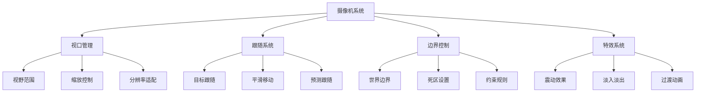
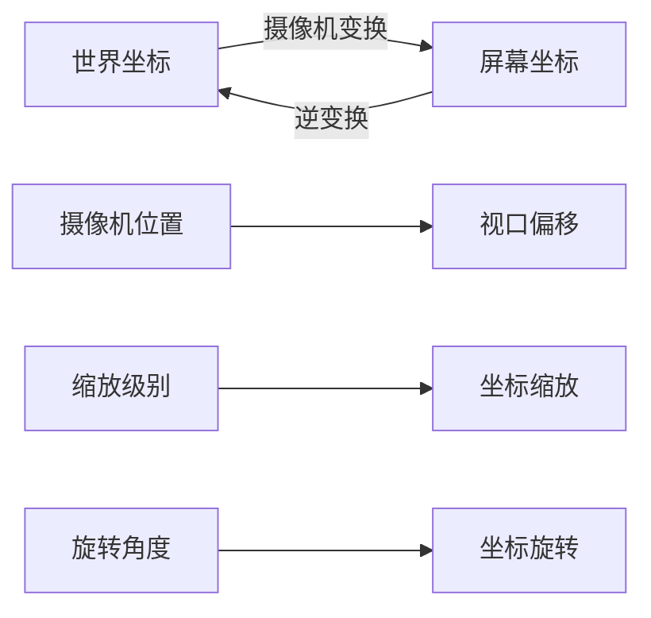
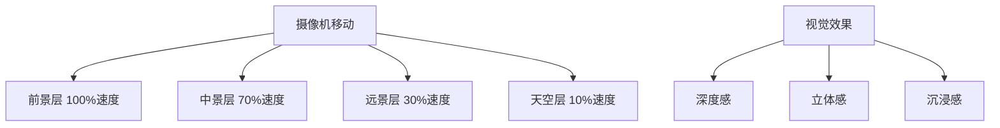

# Day 4: 摄像机与场景滚动

> 🎯 **今日目标**: 掌握摄像机系统和场景滚动，创建大型游戏世界的浏览体验
> 
> ⏱️ **预计时间**: 2-3小时
> 
> 📦 **今日产出**: 一个完整的卷轴滚动游戏场景

---

## 📚 理论讲解

### 什么是摄像机系统？

摄像机系统是游戏引擎中负责控制玩家视野的核心组件。它决定了玩家能看到游戏世界的哪一部分，以及如何呈现这些内容。在2D游戏中，摄像机本质上是一个可移动的"窗口"，通过这个窗口玩家可以观察到游戏世界的不同区域。

在Phaser.js中，每个Scene都有一个默认的主摄像机（Main Camera），同时支持创建多个摄像机实现复杂的视觉效果。摄像机不仅控制视野范围，还负责坐标变换、渲染优化和视觉特效。

#### 🌟 摄像机系统的核心作用

1. **视野控制**: 决定玩家能看到的游戏世界范围
2. **跟随目标**: 自动跟随玩家或其他重要对象
3. **边界限制**: 防止摄像机移动到游戏世界之外
4. **平滑移动**: 提供流畅的视觉体验
5. **特效支持**: 震动、缩放、旋转等视觉效果

#### 🎮 摄像机系统的应用场景

- **平台跳跃游戏**: 跟随玩家角色的移动
- **卷轴射击游戏**: 自动或手动控制的场景滚动
- **RPG游戏**: 探索大型游戏世界
- **策略游戏**: 自由浏览战场全局

### 摄像机系统架构



### 坐标系统详解

理解坐标系统是掌握摄像机的关键。在Phaser.js中存在多种坐标系统：

#### 世界坐标系 (World Coordinates)
- 游戏世界的绝对坐标系统
- 所有游戏对象的真实位置
- 不受摄像机位置影响

#### 屏幕坐标系 (Screen Coordinates)
- 相对于游戏画布的坐标系统
- 用户在屏幕上看到的位置
- 受摄像机位置和缩放影响

#### 摄像机坐标系 (Camera Coordinates)
- 相对于摄像机的坐标系统
- 用于计算对象是否在视野内
- 摄像机移动时坐标会相应变化



### 摄像机跟随系统

#### 跟随模式类型

**1. 直接跟随 (Direct Follow)**
```javascript
// 摄像机直接跟随目标，没有延迟
camera.startFollow(player);

// API详解：
// - target: 要跟随的游戏对象
// - roundPixels: 是否四舍五入像素位置（默认false）
// - lerpX: X轴插值系数（默认1，即立即跟随）
// - lerpY: Y轴插值系数（默认1，即立即跟随）
```

**2. 平滑跟随 (Smooth Follow)**
```javascript
// 摄像机平滑地跟随目标
camera.startFollow(player, true, 0.1, 0.1);

// 参数说明：
// - roundPixels: true 确保像素对齐，避免模糊
// - lerpX: 0.1 表示每帧移动距离的10%
// - lerpY: 0.1 Y轴跟随速度
// 值越小跟随越平滑，但响应越慢
```

**3. 死区跟随 (Deadzone Follow)**
```javascript
// 只有当目标离开死区时摄像机才移动
camera.setDeadzone(100, 100);
camera.startFollow(player);

// 死区API详解：
// camera.setDeadzone(width, height) - 设置矩形死区
// camera.deadzone - 获取当前死区对象
// camera.deadzone.x/y - 死区中心位置
// camera.deadzone.width/height - 死区尺寸
```

**4. 预测跟随 (Predictive Follow)**
```javascript
// 根据目标的移动方向预测位置
camera.setFollowOffset(50, 0); // 向前偏移

// 高级预测跟随实现
class PredictiveFollow {
    constructor(camera, target) {
        this.camera = camera;
        this.target = target;
        this.lastPosition = { x: target.x, y: target.y };
        this.velocity = { x: 0, y: 0 };
        this.predictionFactor = 2; // 预测强度
    }
    
    update() {
        // 计算目标速度
        this.velocity.x = this.target.x - this.lastPosition.x;
        this.velocity.y = this.target.y - this.lastPosition.y;
        
        // 预测未来位置
        const predictedX = this.target.x + this.velocity.x * this.predictionFactor;
        const predictedY = this.target.y + this.velocity.y * this.predictionFactor;
        
        // 设置摄像机偏移
        this.camera.setFollowOffset(
            this.velocity.x * this.predictionFactor,
            this.velocity.y * this.predictionFactor
        );
        
        // 更新上一帧位置
        this.lastPosition.x = this.target.x;
        this.lastPosition.y = this.target.y;
    }
}
```

#### 跟随算法实现

```javascript
class CameraController {
    constructor(camera, target) {
        this.camera = camera;
        this.target = target;
        this.smoothness = 0.1;
        this.deadzone = { x: 100, y: 100 };
        this.offset = { x: 0, y: 0 };
    }
    
    update(deltaTime) {
        if (!this.target) return;
        
        // 计算目标位置
        const targetX = this.target.x + this.offset.x;
        const targetY = this.target.y + this.offset.y;
        
        // 计算摄像机中心
        const cameraCenterX = this.camera.scrollX + this.camera.width / 2;
        const cameraCenterY = this.camera.scrollY + this.camera.height / 2;
        
        // 检查是否在死区内
        const deltaX = targetX - cameraCenterX;
        const deltaY = targetY - cameraCenterY;
        
        if (Math.abs(deltaX) > this.deadzone.x / 2) {
            const newX = this.lerp(cameraCenterX, targetX, this.smoothness);
            this.camera.scrollX = newX - this.camera.width / 2;
        }
        
        if (Math.abs(deltaY) > this.deadzone.y / 2) {
            const newY = this.lerp(cameraCenterY, targetY, this.smoothness);
            this.camera.scrollY = newY - this.camera.height / 2;
        }
    }
    
    lerp(start, end, factor) {
        return start + (end - start) * factor;
    }
}
```

### 视差滚动系统

视差滚动是创造深度感和沉浸感的重要技术，通过让不同层级的背景以不同速度移动来模拟3D效果。

#### 视差滚动原理



#### 多层背景实现

```javascript
class ParallaxBackground {
    constructor(scene) {
        this.scene = scene;
        this.layers = [];
    }
    
    addLayer(texture, scrollFactor, depth = 0) {
        const layer = this.scene.add.tileSprite(
            0, 0, 
            this.scene.cameras.main.width, 
            this.scene.cameras.main.height, 
            texture
        );
        
        layer.setScrollFactor(scrollFactor);
        layer.setDepth(depth);
        layer.setOrigin(0, 0);
        
        this.layers.push({
            sprite: layer,
            scrollFactor: scrollFactor,
            originalX: 0
        });
        
        return layer;
    }
    
    update() {
        const camera = this.scene.cameras.main;
        
        this.layers.forEach(layer => {
            // 计算视差偏移
            const offsetX = camera.scrollX * (1 - layer.scrollFactor);
            layer.sprite.tilePositionX = offsetX;
        });
    }
}
```

### 摄像机边界和约束

#### 世界边界设置

```javascript
// 设置摄像机边界 - 基础API
camera.setBounds(0, 0, worldWidth, worldHeight);

// 边界API详解：
// camera.setBounds(x, y, width, height) - 设置边界矩形
// camera.removeBounds() - 移除边界限制
// camera.bounds - 获取当前边界对象
// camera.useBounds - 是否启用边界检查

// 动态边界调整
camera.setBounds(0, 0, 2400, 1600);
// 在运行时修改边界
camera.bounds.width = 3200;
camera.bounds.height = 2400;

// 自定义边界检查
class CameraBounds {
    constructor(camera, bounds) {
        this.camera = camera;
        this.bounds = bounds; // { x, y, width, height }
        this.padding = { top: 50, right: 50, bottom: 50, left: 50 };
    }
    
    constrainCamera() {
        // 计算有效边界（考虑内边距）
        const minX = this.bounds.x + this.padding.left;
        const minY = this.bounds.y + this.padding.top;
        const maxX = this.bounds.x + this.bounds.width - this.camera.width - this.padding.right;
        const maxY = this.bounds.y + this.bounds.height - this.camera.height - this.padding.bottom;
        
        // 应用约束
        this.camera.scrollX = Phaser.Math.Clamp(this.camera.scrollX, minX, maxX);
        this.camera.scrollY = Phaser.Math.Clamp(this.camera.scrollY, minY, maxY);
    }
    
    // 检查是否接近边界
    isNearBoundary(threshold = 100) {
        const bounds = this.getBoundaryDistances();
        return Object.values(bounds).some(distance => distance < threshold);
    }
    
    getBoundaryDistances() {
        return {
            left: this.camera.scrollX - this.bounds.x,
            right: (this.bounds.x + this.bounds.width) - (this.camera.scrollX + this.camera.width),
            top: this.camera.scrollY - this.bounds.y,
            bottom: (this.bounds.y + this.bounds.height) - (this.camera.scrollY + this.camera.height)
        };
    }
}
```

#### 智能边界系统

```javascript
class SmartCameraBounds {
    constructor(camera) {
        this.camera = camera;
        this.dynamicBounds = [];
    }
    
    addDynamicBound(condition, bounds) {
        this.dynamicBounds.push({ condition, bounds });
    }
    
    update() {
        // 根据游戏状态动态调整边界
        for (const bound of this.dynamicBounds) {
            if (bound.condition()) {
                this.camera.setBounds(
                    bound.bounds.x, 
                    bound.bounds.y, 
                    bound.bounds.width, 
                    bound.bounds.height
                );
                break;
            }
        }
    }
}
```

### 摄像机特效系统

#### 震动效果

```javascript
class CameraShake {
    constructor(camera) {
        this.camera = camera;
        this.isShaking = false;
        this.shakeIntensity = 0;
        this.shakeDuration = 0;
        this.shakeTimer = 0;
    }
    
    shake(intensity, duration) {
        this.shakeIntensity = intensity;
        this.shakeDuration = duration;
        this.shakeTimer = 0;
        this.isShaking = true;
    }
    
    update(deltaTime) {
        if (!this.isShaking) return;
        
        this.shakeTimer += deltaTime;
        
        if (this.shakeTimer >= this.shakeDuration) {
            this.isShaking = false;
            this.camera.setScroll(this.camera.scrollX, this.camera.scrollY);
            return;
        }
        
        // 计算震动偏移
        const progress = this.shakeTimer / this.shakeDuration;
        const currentIntensity = this.shakeIntensity * (1 - progress);
        
        const offsetX = (Math.random() - 0.5) * currentIntensity;
        const offsetY = (Math.random() - 0.5) * currentIntensity;
        
        this.camera.setScroll(
            this.camera.scrollX + offsetX,
            this.camera.scrollY + offsetY
        );
    }
}
```

#### 缩放和旋转效果

```javascript
class CameraEffects {
    constructor(camera) {
        this.camera = camera;
        this.originalZoom = camera.zoom;
        this.originalRotation = camera.rotation;
    }
    
    // 平滑缩放
    zoomTo(targetZoom, duration = 1000) {
        this.camera.scene.tweens.add({
            targets: this.camera,
            zoom: targetZoom,
            duration: duration,
            ease: 'Power2'
        });
    }
    
    // 旋转效果
    rotateTo(targetRotation, duration = 1000) {
        this.camera.scene.tweens.add({
            targets: this.camera,
            rotation: targetRotation,
            duration: duration,
            ease: 'Power2'
        });
    }
    
    // 聚焦效果
    focusOn(target, zoomLevel = 2, duration = 1000) {
        const targetX = target.x - this.camera.width / 2;
        const targetY = target.y - this.camera.height / 2;
        
        this.camera.scene.tweens.add({
            targets: this.camera,
            scrollX: targetX,
            scrollY: targetY,
            zoom: zoomLevel,
            duration: duration,
            ease: 'Power2'
        });
    }
}
```

### 多摄像机系统

Phaser.js支持多个摄像机同时工作，这对于实现小地图、分屏游戏等功能非常有用。

#### 多摄像机设置

```javascript
class MultiCameraSystem {
    constructor(scene) {
        this.scene = scene;
        this.cameras = [];
        this.mainCamera = scene.cameras.main;
    }
    
    // 创建小地图摄像机
    createMinimapCamera(x, y, width, height) {
        const minimap = this.scene.cameras.add(x, y, width, height);
        minimap.setZoom(0.2);
        minimap.setName('minimap');
        
        // 设置边框
        minimap.setBackgroundColor(0x000000);
        
        this.cameras.push(minimap);
        return minimap;
    }
    
    // 创建分屏摄像机
    createSplitScreenCamera(player, viewport) {
        const camera = this.scene.cameras.add(
            viewport.x, 
            viewport.y, 
            viewport.width, 
            viewport.height
        );
        
        camera.startFollow(player);
        camera.setName(`player_${player.id}`);
        
        this.cameras.push(camera);
        return camera;
    }
    
    // 同步摄像机
    syncCameras(sourceCamera, targetCameras) {
        targetCameras.forEach(camera => {
            camera.setScroll(sourceCamera.scrollX, sourceCamera.scrollY);
        });
    }
}
```

### 性能优化策略

#### 视口剔除优化

```javascript
class CameraCulling {
    constructor(camera) {
        this.camera = camera;
        this.cullingMargin = 100; // 剔除边距
    }
    
    // 检查对象是否在摄像机视野内
    isInView(gameObject) {
        const bounds = gameObject.getBounds();
        const cameraBounds = this.getCameraBounds();
        
        return this.boundsOverlap(bounds, cameraBounds);
    }
    
    getCameraBounds() {
        return {
            x: this.camera.scrollX - this.cullingMargin,
            y: this.camera.scrollY - this.cullingMargin,
            width: this.camera.width + this.cullingMargin * 2,
            height: this.camera.height + this.cullingMargin * 2
        };
    }
    
    boundsOverlap(bounds1, bounds2) {
        return bounds1.x < bounds2.x + bounds2.width &&
               bounds1.x + bounds1.width > bounds2.x &&
               bounds1.y < bounds2.y + bounds2.height &&
               bounds1.y + bounds1.height > bounds2.y;
    }
    
    // 批量剔除对象
    cullObjects(objects) {
        const cameraBounds = this.getCameraBounds();
        
        objects.forEach(obj => {
            const inView = this.isInView(obj);
            obj.setVisible(inView);
            
            // 可选：停止不可见对象的更新
            if (obj.body) {
                obj.body.enable = inView;
            }
        });
    }
}
```

#### 渲染优化

```javascript
class CameraRenderOptimizer {
    constructor(scene) {
        this.scene = scene;
        this.renderLayers = new Map();
    }
    
    // 创建渲染层
    createRenderLayer(name, depth) {
        const layer = this.scene.add.layer();
        layer.setDepth(depth);
        layer.setName(name);
        
        this.renderLayers.set(name, layer);
        return layer;
    }
    
    // 动态调整渲染质量
    adjustRenderQuality(cameraSpeed) {
        const quality = cameraSpeed > 200 ? 'low' : 'high';
        
        if (quality === 'low') {
            // 降低粒子效果
            this.scene.particles.setVisible(false);
            // 简化动画
            this.scene.anims.globalTimeScale = 0.5;
        } else {
            // 恢复正常渲染
            this.scene.particles.setVisible(true);
            this.scene.anims.globalTimeScale = 1;
        }
    }
}
```

### 摄像机API完整参考

#### 核心摄像机属性

```javascript
// 位置和滚动
camera.x, camera.y           // 摄像机在场景中的位置
camera.scrollX, camera.scrollY // 摄像机滚动偏移
camera.centerX, camera.centerY // 摄像机中心点坐标
camera.displayWidth, camera.displayHeight // 显示尺寸

// 缩放和旋转
camera.zoom                  // 缩放级别 (默认1)
camera.rotation              // 旋转角度 (弧度)
camera.originX, camera.originY // 变换原点 (默认0.5, 0.5)

// 视口和边界
camera.width, camera.height  // 摄像机视口尺寸
camera.bounds                // 边界矩形对象
camera.useBounds            // 是否使用边界限制
camera.deadzone             // 死区对象

// 跟随相关
camera.followTarget         // 当前跟随的目标
camera.lerp                 // 插值系数对象 {x, y}
camera.followOffset         // 跟随偏移 {x, y}
```

#### 摄像机控制方法

```javascript
// 基础控制
camera.setScroll(x, y)      // 设置滚动位置
camera.scrollTo(x, y)       // 滚动到指定位置
camera.centerOn(x, y)       // 居中到指定位置
camera.pan(x, y, duration, ease, force, callback) // 平移动画

// 缩放控制
camera.setZoom(zoom)        // 设置缩放级别
camera.zoomTo(zoom, duration, ease, force, callback) // 缩放动画

// 旋转控制
camera.setRotation(rotation) // 设置旋转角度
camera.rotateTo(rotation, duration, ease, force, callback) // 旋转动画

// 跟随控制
camera.startFollow(target, roundPixels, lerpX, lerpY) // 开始跟随
camera.stopFollow()         // 停止跟随
camera.setFollowOffset(x, y) // 设置跟随偏移
camera.setLerp(x, y)        // 设置插值系数

// 边界控制
camera.setBounds(x, y, width, height) // 设置边界
camera.removeBounds()       // 移除边界
camera.setDeadzone(width, height) // 设置死区

// 特效控制
camera.shake(duration, intensity, force, callback) // 震动效果
camera.flash(duration, red, green, blue, force, callback) // 闪光效果
camera.fade(duration, red, green, blue, force, callback) // 淡入淡出
```

#### 坐标转换API

```javascript
// 世界坐标转屏幕坐标
const screenPoint = camera.getWorldPoint(worldX, worldY);

// 屏幕坐标转世界坐标  
const worldPoint = camera.getWorldPoint(screenX, screenY);

// 获取摄像机可见区域
const visibleBounds = {
    x: camera.scrollX,
    y: camera.scrollY,
    width: camera.width,
    height: camera.height
};

// 检查点是否在摄像机视野内
function isPointInView(camera, x, y) {
    return x >= camera.scrollX && 
           x <= camera.scrollX + camera.width &&
           y >= camera.scrollY && 
           y <= camera.scrollY + camera.height;
}

// 检查矩形是否与摄像机视野相交
function isRectInView(camera, rect) {
    return !(rect.x + rect.width < camera.scrollX ||
             rect.x > camera.scrollX + camera.width ||
             rect.y + rect.height < camera.scrollY ||
             rect.y > camera.scrollY + camera.height);
}
```

#### 高级摄像机控制器

```javascript
class AdvancedCameraController {
    constructor(scene, camera) {
        this.scene = scene;
        this.camera = camera;
        this.isLocked = false;
        this.lockDuration = 0;
        this.lockTimer = 0;
        this.originalTarget = null;
    }
    
    // 临时锁定摄像机到指定位置
    lockToPosition(x, y, duration = 1000) {
        this.originalTarget = this.camera.followTarget;
        this.camera.stopFollow();
        
        this.scene.tweens.add({
            targets: this.camera,
            scrollX: x - this.camera.width / 2,
            scrollY: y - this.camera.height / 2,
            duration: 500,
            ease: 'Power2',
            onComplete: () => {
                this.isLocked = true;
                this.lockDuration = duration;
                this.lockTimer = 0;
            }
        });
    }
    
    // 创建电影镜头效果
    createCinematicShot(keyframes, duration = 3000) {
        const timeline = this.scene.tweens.createTimeline();
        
        keyframes.forEach((keyframe, index) => {
            timeline.add({
                targets: this.camera,
                scrollX: keyframe.x - this.camera.width / 2,
                scrollY: keyframe.y - this.camera.height / 2,
                zoom: keyframe.zoom || this.camera.zoom,
                rotation: keyframe.rotation || this.camera.rotation,
                duration: keyframe.duration || duration / keyframes.length,
                ease: keyframe.ease || 'Power2',
                offset: keyframe.offset || 0
            });
        });
        
        timeline.play();
        return timeline;
    }
    
    // 智能跟随（根据目标速度调整跟随参数）
    enableSmartFollow(target) {
        this.camera.startFollow(target, true, 0.1, 0.1);
        
        this.scene.events.on('update', () => {
            if (!target.body) return;
            
            const speed = Math.abs(target.body.velocity.x) + Math.abs(target.body.velocity.y);
            
            // 根据速度调整跟随参数
            if (speed > 200) {
                // 高速移动时，增加预测性
                this.camera.setLerp(0.15, 0.15);
                this.camera.setFollowOffset(target.body.velocity.x * 0.1, 0);
            } else if (speed > 100) {
                // 中速移动
                this.camera.setLerp(0.1, 0.1);
                this.camera.setFollowOffset(target.body.velocity.x * 0.05, 0);
            } else {
                // 慢速或静止
                this.camera.setLerp(0.05, 0.05);
                this.camera.setFollowOffset(0, 0);
            }
        });
    }
    
    update(deltaTime) {
        if (this.isLocked) {
            this.lockTimer += deltaTime;
            if (this.lockTimer >= this.lockDuration) {
                this.isLocked = false;
                if (this.originalTarget) {
                    this.camera.startFollow(this.originalTarget, true, 0.1, 0.1);
                }
            }
        }
    }
}
```

---

## 🛠️ 实践环节

### 环境准备

确保你已经完成了前三天的学习，如果还没有，请先完成环境搭建：

```bash
# 初始化Day 4项目
node project-template/setup-project.js 4_camera

# 进入项目目录
cd 4_camera/source

# 安装依赖
pnpm install

# 启动开发服务器
pnpm dev
```

### 创建基础摄像机跟随

让我们从最简单的摄像机跟随开始：

#### 步骤1: 创建大型游戏世界

```javascript
create() {
    // 设置世界边界
    this.physics.world.setBounds(0, 0, 2400, 1600);
    
    // 创建大型背景
    this.createLargeBackground();
    
    // 创建玩家
    this.player = this.physics.add.sprite(100, 100, 'player');
    this.player.setCollideWorldBounds(true);
    
    // 设置摄像机跟随
    this.cameras.main.startFollow(this.player);
    this.cameras.main.setBounds(0, 0, 2400, 1600);
}

createLargeBackground() {
    // 创建网格背景
    const graphics = this.add.graphics();
    graphics.lineStyle(1, 0x333333, 0.5);
    
    for (let x = 0; x <= 2400; x += 100) {
        graphics.moveTo(x, 0);
        graphics.lineTo(x, 1600);
    }
    
    for (let y = 0; y <= 1600; y += 100) {
        graphics.moveTo(0, y);
        graphics.lineTo(2400, y);
    }
    
    graphics.strokePath();
}
```

#### 步骤2: 添加平滑跟随

```javascript
create() {
    // ... 其他创建代码 ...
    
    // 设置平滑跟随
    this.cameras.main.startFollow(this.player, true, 0.05, 0.05);
    
    // 设置死区
    this.cameras.main.setDeadzone(150, 100);
    
    // 设置跟随偏移
    this.cameras.main.setFollowOffset(0, 50);
}
```

#### 步骤3: 添加摄像机控制

```javascript
update() {
    // 玩家移动控制
    this.handlePlayerMovement();
    
    // 摄像机特殊控制
    this.handleCameraControls();
}

handleCameraControls() {
    // 缩放控制
    if (this.input.keyboard.addKey('Q').isDown) {
        this.cameras.main.zoom = Math.min(2, this.cameras.main.zoom + 0.01);
    }
    if (this.input.keyboard.addKey('E').isDown) {
        this.cameras.main.zoom = Math.max(0.5, this.cameras.main.zoom - 0.01);
    }
    
    // 震动效果
    if (this.input.keyboard.addKey('SPACE').isDown) {
        this.cameras.main.shake(200, 0.01);
    }
}
```

### 实现视差滚动

现在让我们添加多层背景的视差滚动效果：

#### 步骤1: 创建多层背景

```javascript
create() {
    // 创建视差背景系统
    this.parallaxBg = new ParallaxBackground(this);
    
    // 添加不同层级的背景
    this.parallaxBg.addLayer('sky', 0, -100);      // 天空层，不移动
    this.parallaxBg.addLayer('mountains', 0.1, -90); // 远山，慢速移动
    this.parallaxBg.addLayer('trees', 0.3, -80);     // 树林，中速移动
    this.parallaxBg.addLayer('grass', 0.7, -70);     // 草地，快速移动
}

update() {
    // 更新视差背景
    this.parallaxBg.update();
}
```

#### 步骤2: 创建背景纹理

```javascript
preload() {
    // 程序化创建背景纹理
    this.createBackgroundTextures();
}

createBackgroundTextures() {
    // 天空纹理
    const skyGraphics = this.add.graphics();
    skyGraphics.fillGradientStyle(0x87CEEB, 0x87CEEB, 0xFFFFFF, 0xFFFFFF, 1);
    skyGraphics.fillRect(0, 0, 800, 600);
    skyGraphics.generateTexture('sky', 800, 600);
    
    // 山脉纹理
    const mountainGraphics = this.add.graphics();
    mountainGraphics.fillStyle(0x8B7355);
    mountainGraphics.beginPath();
    mountainGraphics.moveTo(0, 400);
    for (let x = 0; x <= 800; x += 50) {
        const height = 300 + Math.sin(x * 0.01) * 100;
        mountainGraphics.lineTo(x, height);
    }
    mountainGraphics.lineTo(800, 600);
    mountainGraphics.lineTo(0, 600);
    mountainGraphics.closePath();
    mountainGraphics.fillPath();
    mountainGraphics.generateTexture('mountains', 800, 600);
    
    // 清理临时图形
    skyGraphics.destroy();
    mountainGraphics.destroy();
}
```

---

## 🎯 今日练习

### 练习 1: 基础摄像机跟随 ⭐

**目标**: 实现一个基本的摄像机跟随系统

**要求**:
1. 创建一个大于屏幕的游戏世界
2. 实现摄像机跟随玩家移动
3. 设置世界边界限制
4. 添加摄像机死区

**提示**:
```javascript
// 设置摄像机跟随
this.cameras.main.startFollow(player);
this.cameras.main.setBounds(0, 0, worldWidth, worldHeight);
this.cameras.main.setDeadzone(100, 100);
```

### 练习 2: 视差滚动背景 ⭐⭐

**目标**: 创建多层视差滚动背景

**要求**:
1. 创建至少3层不同速度的背景
2. 实现平滑的视差滚动效果
3. 添加背景纹理和细节
4. 优化滚动性能

**提示**:
```javascript
// 设置不同的滚动因子
backgroundLayer.setScrollFactor(0.1);
midgroundLayer.setScrollFactor(0.5);
foregroundLayer.setScrollFactor(0.8);
```

### 练习 3: 摄像机特效系统 ⭐⭐⭐

**目标**: 实现丰富的摄像机特效

**要求**:
1. 实现摄像机震动效果
2. 添加平滑缩放功能
3. 创建聚焦和过渡动画
4. 实现动态摄像机边界

**挑战**: 创建电影级的摄像机运镜效果

---

## 🔍 常见问题解答

### Q1: 摄像机跟随不够平滑怎么办？

**A**: 调整跟随参数：
1. 降低lerp值 (0.02-0.1)
2. 增大死区范围
3. 使用自定义平滑算法
4. 检查帧率是否稳定

### Q2: 视差滚动出现撕裂怎么解决？

**A**: 优化建议：
1. 确保背景图片尺寸合适
2. 使用TileSprite而不是普通Sprite
3. 调整滚动因子的精度
4. 启用像素完美渲染

### Q3: 大世界游戏性能问题？

**A**: 性能优化：
1. 实现视口剔除
2. 使用对象池管理
3. 动态加载/卸载区域
4. 降低不可见区域的更新频率

### Q4: 多摄像机如何协调？

**A**: 协调策略：
1. 明确主从关系
2. 统一坐标系统
3. 合理分配渲染层级
4. 避免重复渲染

---

## 📖 延伸阅读

### 摄像机设计理论
- [Game Camera Design Principles](https://www.gamasutra.com/view/feature/132313/the_art_of_game_design_a_book_of_.php)
- [2D Camera Systems](https://docs.unity3d.com/Manual/class-Camera.html)

### 技术文档
- [Phaser 3 Camera文档](https://photonstorm.github.io/phaser3-docs/Phaser.Cameras.Scene2D.Camera.html)
- [视差滚动技术指南](https://developer.mozilla.org/en-US/docs/Web/API/Canvas_API/Tutorial/Optimizing_canvas)

### 学习资源
- [摄像机运动设计](https://www.youtube.com/watch?v=dwBBwjSO0ZI)
- [视差滚动最佳实践](https://css-tricks.com/parallax-scrolling/)

---

## 🎉 今日总结

恭喜你完成了Phaser.js的第四天学习！今天你学到了：

### ✅ 核心概念
- 摄像机系统的工作原理和架构
- 坐标系统的转换和管理
- 视差滚动的实现原理
- 摄像机特效的设计思路

### ✅ 实践技能
- 实现平滑的摄像机跟随
- 创建多层视差滚动背景
- 设计摄像机边界和约束
- 开发摄像机特效系统

### ✅ 开发工具
- 掌握多摄像机系统的使用
- 学会性能优化的技巧
- 了解视口剔除的实现
- 理解渲染层级的管理

### 🚀 明天预告

明天我们将学习：
- **敌人系统**: 创建智能的游戏AI
- **碰撞响应**: 实现复杂的交互逻辑
- **对象管理**: 高效的游戏对象组织
- **实践项目**: 制作一个完整的动作游戏

你已经掌握了创建大型游戏世界的核心技术，继续加油！🎬

---

> 💡 **学习提示**: 摄像机系统是游戏体验的重要组成部分，好的摄像机设计能够大幅提升游戏的沉浸感和可玩性。
> 
> 🎮 **设计建议**: 可以研究经典游戏的摄像机设计，如《超级马里奥》、《塞尔达传说》等，学习它们的摄像机运镜技巧。
