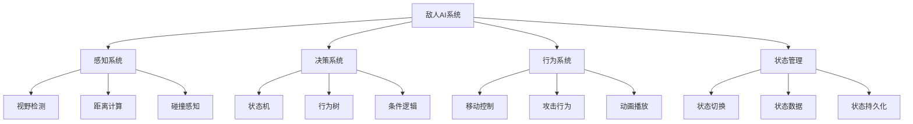
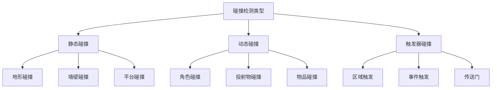

# Day 5: 敌人与碰撞检测

> 🎯 **今日目标**: 掌握敌人AI系统和碰撞检测，创建有挑战性的游戏体验
> 
> ⏱️ **预计时间**: 3-4小时
> 
> 📦 **今日产出**: 一个包含智能敌人和完整交互系统的动作游戏

---

## 📚 理论讲解

### 什么是游戏AI系统？

游戏AI（人工智能）系统是控制非玩家角色（NPC）行为的核心机制。在2D游戏中，AI系统主要负责敌人的移动模式、攻击策略、状态管理和与玩家的交互逻辑。一个好的AI系统能够让游戏更具挑战性和趣味性，同时保持合理的难度曲线。

在Phaser.js中，AI系统通常通过状态机、行为树或简单的条件逻辑来实现。我们可以利用物理引擎的碰撞检测、距离计算和路径寻找等功能来创建智能的敌人行为。

#### 🌟 游戏AI系统的核心作用

1. **行为控制**: 控制敌人的移动、攻击和防御行为
2. **状态管理**: 管理敌人的不同状态（巡逻、追击、攻击、死亡等）
3. **决策制定**: 根据游戏情况做出合理的行为选择
4. **交互响应**: 对玩家行为和环境变化做出反应
5. **难度平衡**: 提供适当的挑战性而不会过于困难

#### 🎮 AI系统的应用场景

- **平台跳跃游戏**: 巡逻敌人、跳跃怪物、飞行敌人
- **射击游戏**: 追击敌人、远程攻击、掩护行为
- **RPG游戏**: 复杂的战斗AI、队伍协作
- **策略游戏**: 资源管理、战术决策

### 敌人AI系统架构



### 状态机设计模式

状态机是AI系统中最常用的设计模式，它将敌人的行为分解为不同的状态，每个状态都有明确的进入条件、执行逻辑和退出条件。

#### 基础状态机实现

```javascript
class EnemyStateMachine {
    constructor(enemy) {
        this.enemy = enemy;
        this.currentState = null;
        this.states = new Map();
        this.globalState = null;
        this.previousState = null;
    }
    
    // 添加状态
    addState(name, state) {
        this.states.set(name, state);
        state.owner = this.enemy;
        state.stateMachine = this;
    }
    
    // 切换状态
    changeState(newStateName) {
        if (!this.states.has(newStateName)) {
            console.warn(`State ${newStateName} not found`);
            return;
        }
        
        // 退出当前状态
        if (this.currentState) {
            this.currentState.exit();
            this.previousState = this.currentState;
        }
        
        // 进入新状态
        this.currentState = this.states.get(newStateName);
        this.currentState.enter();
    }
    
    // 更新状态机
    update(deltaTime) {
        // 更新全局状态
        if (this.globalState) {
            this.globalState.update(deltaTime);
        }
        
        // 更新当前状态
        if (this.currentState) {
            this.currentState.update(deltaTime);
        }
    }
    
    // 处理消息
    handleMessage(message) {
        if (this.currentState && this.currentState.handleMessage) {
            return this.currentState.handleMessage(message);
        }
        return false;
    }
    
    // 回到上一个状态
    revertToPreviousState() {
        if (this.previousState) {
            this.changeState(this.previousState.name);
        }
    }
    
    // 检查当前状态
    isInState(stateName) {
        return this.currentState && this.currentState.name === stateName;
    }
}
```

#### 状态基类

```javascript
class State {
    constructor(name) {
        this.name = name;
        this.owner = null;
        this.stateMachine = null;
    }
    
    // 进入状态时调用
    enter() {
        // 子类实现
    }
    
    // 每帧更新时调用
    update(deltaTime) {
        // 子类实现
    }
    
    // 退出状态时调用
    exit() {
        // 子类实现
    }
    
    // 处理消息
    handleMessage(message) {
        // 子类实现
        return false;
    }
}
```#
## 敌人感知系统

感知系统是AI的"眼睛"和"耳朵"，负责收集环境信息并为决策系统提供数据。

#### 视野检测系统

```javascript
class VisionSystem {
    constructor(owner) {
        this.owner = owner;
        this.viewDistance = 200;
        this.viewAngle = Math.PI / 3; // 60度视角
        this.viewDirection = 0; // 朝向角度
    }
    
    // 检查目标是否在视野内
    canSee(target) {
        const distance = Phaser.Math.Distance.Between(
            this.owner.x, this.owner.y,
            target.x, target.y
        );
        
        // 距离检查
        if (distance > this.viewDistance) {
            return false;
        }
        
        // 角度检查
        const angleToTarget = Phaser.Math.Angle.Between(
            this.owner.x, this.owner.y,
            target.x, target.y
        );
        
        const angleDiff = Math.abs(angleToTarget - this.viewDirection);
        const normalizedAngleDiff = Math.min(angleDiff, 2 * Math.PI - angleDiff);
        
        if (normalizedAngleDiff > this.viewAngle / 2) {
            return false;
        }
        
        // 障碍物检查（射线检测）
        return this.hasLineOfSight(target);
    }
    
    // 射线检测 - 检查是否有障碍物阻挡
    hasLineOfSight(target) {
        const scene = this.owner.scene;
        const line = new Phaser.Geom.Line(
            this.owner.x, this.owner.y,
            target.x, target.y
        );
        
        // 检查与地形的碰撞
        if (scene.tilemap) {
            const points = line.getPoints(0, Math.floor(line.length / 16));
            for (const point of points) {
                const tile = scene.tilemap.getTileAtWorldXY(point.x, point.y);
                if (tile && tile.collides) {
                    return false;
                }
            }
        }
        
        return true;
    }
    
    // 获取视野内的所有目标
    getTargetsInView(targets) {
        return targets.filter(target => this.canSee(target));
    }
    
    // 可视化视野范围（调试用）
    debugDraw(graphics) {
        graphics.clear();
        graphics.lineStyle(2, 0xff0000, 0.5);
        
        // 绘制视野扇形
        const startAngle = this.viewDirection - this.viewAngle / 2;
        const endAngle = this.viewDirection + this.viewAngle / 2;
        
        graphics.beginPath();
        graphics.moveTo(this.owner.x, this.owner.y);
        graphics.arc(
            this.owner.x, this.owner.y,
            this.viewDistance,
            startAngle, endAngle
        );
        graphics.closePath();
        graphics.strokePath();
    }
}
```

#### 听觉系统

```javascript
class HearingSystem {
    constructor(owner) {
        this.owner = owner;
        this.hearingRange = 150;
        this.soundEvents = [];
    }
    
    // 添加声音事件
    addSoundEvent(x, y, volume, type = 'generic') {
        const distance = Phaser.Math.Distance.Between(
            this.owner.x, this.owner.y, x, y
        );
        
        if (distance <= this.hearingRange * volume) {
            this.soundEvents.push({
                x, y, volume, type,
                distance,
                timestamp: Date.now()
            });
        }
    }
    
    // 获取最近的声音事件
    getLatestSound() {
        if (this.soundEvents.length === 0) return null;
        
        // 清理过期的声音事件
        const now = Date.now();
        this.soundEvents = this.soundEvents.filter(
            event => now - event.timestamp < 3000
        );
        
        // 返回最近的声音
        return this.soundEvents.reduce((latest, current) => 
            current.timestamp > latest.timestamp ? current : latest
        );
    }
    
    // 清理声音事件
    clearSounds() {
        this.soundEvents = [];
    }
}
```### 敌人
行为系统

行为系统定义了敌人的具体行动逻辑，包括移动、攻击、防御等行为。

#### 巡逻行为

```javascript
class PatrolState extends State {
    constructor() {
        super('patrol');
        this.patrolPoints = [];
        this.currentPointIndex = 0;
        this.patrolSpeed = 50;
        this.waitTime = 2000; // 在巡逻点等待时间
        this.waitTimer = 0;
        this.isWaiting = false;
    }
    
    enter() {
        console.log(`${this.owner.name} 开始巡逻`);
        this.owner.setTint(0xffffff); // 正常颜色
        
        // 如果没有巡逻点，创建默认巡逻路径
        if (this.patrolPoints.length === 0) {
            this.createDefaultPatrolPath();
        }
        
        this.moveToNextPoint();
    }
    
    update(deltaTime) {
        // 检查是否发现玩家
        if (this.owner.visionSystem.canSee(this.owner.scene.player)) {
            this.stateMachine.changeState('chase');
            return;
        }
        
        // 检查是否听到声音
        const sound = this.owner.hearingSystem.getLatestSound();
        if (sound && sound.type === 'footstep') {
            this.owner.lastKnownPlayerPosition = { x: sound.x, y: sound.y };
            this.stateMachine.changeState('investigate');
            return;
        }
        
        if (this.isWaiting) {
            this.waitTimer += deltaTime;
            if (this.waitTimer >= this.waitTime) {
                this.isWaiting = false;
                this.waitTimer = 0;
                this.moveToNextPoint();
            }
        } else {
            this.updateMovement();
        }
    }
    
    updateMovement() {
        const currentPoint = this.patrolPoints[this.currentPointIndex];
        const distance = Phaser.Math.Distance.Between(
            this.owner.x, this.owner.y,
            currentPoint.x, currentPoint.y
        );
        
        if (distance < 10) {
            // 到达巡逻点
            this.isWaiting = true;
            this.owner.setVelocity(0, 0);
            this.owner.anims.play('idle', true);
        } else {
            // 移动到巡逻点
            const angle = Phaser.Math.Angle.Between(
                this.owner.x, this.owner.y,
                currentPoint.x, currentPoint.y
            );
            
            this.owner.setVelocity(
                Math.cos(angle) * this.patrolSpeed,
                Math.sin(angle) * this.patrolSpeed
            );
            
            // 更新朝向
            this.owner.visionSystem.viewDirection = angle;
            this.owner.setFlipX(Math.cos(angle) < 0);
            
            this.owner.anims.play('walk', true);
        }
    }
    
    moveToNextPoint() {
        this.currentPointIndex = (this.currentPointIndex + 1) % this.patrolPoints.length;
    }
    
    createDefaultPatrolPath() {
        const startX = this.owner.x;
        const startY = this.owner.y;
        
        this.patrolPoints = [
            { x: startX - 100, y: startY },
            { x: startX + 100, y: startY },
            { x: startX, y: startY - 50 },
            { x: startX, y: startY + 50 }
        ];
    }
    
    exit() {
        this.owner.setVelocity(0, 0);
    }
}
```

#### 追击行为

```javascript
class ChaseState extends State {
    constructor() {
        super('chase');
        this.chaseSpeed = 80;
        this.loseTargetTime = 3000; // 失去目标后多久放弃追击
        this.loseTargetTimer = 0;
        this.lastSeenPosition = null;
    }
    
    enter() {
        console.log(`${this.owner.name} 开始追击玩家`);
        this.owner.setTint(0xff6666); // 红色表示警戒
        this.loseTargetTimer = 0;
        this.lastSeenPosition = null;
    }
    
    update(deltaTime) {
        const player = this.owner.scene.player;
        const canSeePlayer = this.owner.visionSystem.canSee(player);
        
        if (canSeePlayer) {
            // 能看到玩家，直接追击
            this.loseTargetTimer = 0;
            this.lastSeenPosition = { x: player.x, y: player.y };
            this.chaseTarget(player);
            
            // 检查是否进入攻击范围
            const distance = Phaser.Math.Distance.Between(
                this.owner.x, this.owner.y,
                player.x, player.y
            );
            
            if (distance < 60) {
                this.stateMachine.changeState('attack');
                return;
            }
        } else {
            // 看不到玩家
            this.loseTargetTimer += deltaTime;
            
            if (this.lastSeenPosition) {
                // 追击到最后看到的位置
                const distance = Phaser.Math.Distance.Between(
                    this.owner.x, this.owner.y,
                    this.lastSeenPosition.x, this.lastSeenPosition.y
                );
                
                if (distance > 10) {
                    this.chaseTarget(this.lastSeenPosition);
                } else {
                    this.lastSeenPosition = null;
                }
            }
            
            // 超时后放弃追击
            if (this.loseTargetTimer >= this.loseTargetTime) {
                this.stateMachine.changeState('patrol');
                return;
            }
        }
    }
    
    chaseTarget(target) {
        const angle = Phaser.Math.Angle.Between(
            this.owner.x, this.owner.y,
            target.x, target.y
        );
        
        this.owner.setVelocity(
            Math.cos(angle) * this.chaseSpeed,
            Math.sin(angle) * this.chaseSpeed
        );
        
        // 更新朝向和动画
        this.owner.visionSystem.viewDirection = angle;
        this.owner.setFlipX(Math.cos(angle) < 0);
        this.owner.anims.play('run', true);
    }
    
    exit() {
        this.owner.setVelocity(0, 0);
    }
}
```#
### 攻击行为

```javascript
class AttackState extends State {
    constructor() {
        super('attack');
        this.attackCooldown = 1000; // 攻击冷却时间
        this.attackTimer = 0;
        this.attackRange = 60;
        this.attackDamage = 10;
        this.isAttacking = false;
    }
    
    enter() {
        console.log(`${this.owner.name} 开始攻击`);
        this.owner.setTint(0xff0000); // 红色表示攻击状态
        this.attackTimer = 0;
        this.isAttacking = false;
    }
    
    update(deltaTime) {
        const player = this.owner.scene.player;
        const distance = Phaser.Math.Distance.Between(
            this.owner.x, this.owner.y,
            player.x, player.y
        );
        
        // 如果玩家逃出攻击范围，切换到追击状态
        if (distance > this.attackRange * 1.5) {
            this.stateMachine.changeState('chase');
            return;
        }
        
        this.attackTimer += deltaTime;
        
        if (!this.isAttacking && this.attackTimer >= this.attackCooldown) {
            this.performAttack();
        }
        
        // 面向玩家
        const angle = Phaser.Math.Angle.Between(
            this.owner.x, this.owner.y,
            player.x, player.y
        );
        this.owner.setFlipX(Math.cos(angle) < 0);
    }
    
    performAttack() {
        this.isAttacking = true;
        this.attackTimer = 0;
        
        // 播放攻击动画
        this.owner.anims.play('attack', true);
        
        // 攻击动画完成后执行伤害判定
        this.owner.once('animationcomplete-attack', () => {
            this.dealDamage();
            this.isAttacking = false;
        });
    }
    
    dealDamage() {
        const player = this.owner.scene.player;
        const distance = Phaser.Math.Distance.Between(
            this.owner.x, this.owner.y,
            player.x, player.y
        );
        
        if (distance <= this.attackRange) {
            // 对玩家造成伤害
            if (player.takeDamage) {
                player.takeDamage(this.attackDamage);
            }
            
            // 击退效果
            const angle = Phaser.Math.Angle.Between(
                this.owner.x, this.owner.y,
                player.x, player.y
            );
            
            const knockbackForce = 200;
            player.setVelocity(
                Math.cos(angle) * knockbackForce,
                Math.sin(angle) * knockbackForce
            );
            
            // 屏幕震动效果
            this.owner.scene.cameras.main.shake(200, 0.01);
        }
    }
    
    exit() {
        this.isAttacking = false;
        this.owner.setVelocity(0, 0);
    }
}
```

### 碰撞检测系统

碰撞检测是游戏物理系统的核心，负责检测和处理游戏对象之间的碰撞。

#### 碰撞类型分类



#### 高级碰撞检测系统

```javascript
class CollisionSystem {
    constructor(scene) {
        this.scene = scene;
        this.collisionGroups = new Map();
        this.collisionMatrix = new Map();
        this.collisionCallbacks = new Map();
    }
    
    // 创建碰撞组
    createCollisionGroup(name) {
        const group = this.scene.physics.add.group();
        this.collisionGroups.set(name, group);
        return group;
    }
    
    // 设置碰撞关系
    setCollision(group1Name, group2Name, callback = null, processCallback = null) {
        const group1 = this.collisionGroups.get(group1Name);
        const group2 = this.collisionGroups.get(group2Name);
        
        if (!group1 || !group2) {
            console.warn(`Collision groups not found: ${group1Name}, ${group2Name}`);
            return;
        }
        
        // 设置碰撞检测
        const collider = this.scene.physics.add.collider(
            group1, group2, callback, processCallback
        );
        
        // 记录碰撞关系
        const key = `${group1Name}-${group2Name}`;
        this.collisionMatrix.set(key, collider);
        
        return collider;
    }
    
    // 设置重叠检测
    setOverlap(group1Name, group2Name, callback = null, processCallback = null) {
        const group1 = this.collisionGroups.get(group1Name);
        const group2 = this.collisionGroups.get(group2Name);
        
        if (!group1 || !group2) {
            console.warn(`Collision groups not found: ${group1Name}, ${group2Name}`);
            return;
        }
        
        const overlap = this.scene.physics.add.overlap(
            group1, group2, callback, processCallback
        );
        
        return overlap;
    }
    
    // 添加对象到碰撞组
    addToGroup(groupName, object) {
        const group = this.collisionGroups.get(groupName);
        if (group) {
            group.add(object);
        }
    }
    
    // 移除对象从碰撞组
    removeFromGroup(groupName, object) {
        const group = this.collisionGroups.get(groupName);
        if (group) {
            group.remove(object);
        }
    }
    
    // 自定义碰撞检测
    checkCustomCollision(object1, object2) {
        return this.scene.physics.world.overlap(object1.body, object2.body);
    }
    
    // 射线检测
    raycast(startX, startY, endX, endY, objects) {
        const line = new Phaser.Geom.Line(startX, startY, endX, endY);
        const hits = [];
        
        objects.forEach(obj => {
            if (obj.body) {
                const bounds = obj.body.getBounds();
                const rect = new Phaser.Geom.Rectangle(
                    bounds.x, bounds.y, bounds.width, bounds.height
                );
                
                const intersection = Phaser.Geom.Intersects.GetLineToRectangle(line, rect);
                if (intersection.length > 0) {
                    hits.push({
                        object: obj,
                        point: intersection[0],
                        distance: Phaser.Math.Distance.Between(
                            startX, startY,
                            intersection[0].x, intersection[0].y
                        )
                    });
                }
            }
        });
        
        // 按距离排序
        hits.sort((a, b) => a.distance - b.distance);
        return hits;
    }
}
```---


## 🛠️ 实践环节

### 环境准备

确保你已经完成了前四天的学习，现在让我们创建Day 5的项目：

```bash
# 初始化Day 5项目
node project-template/setup-project.js 5_enemy

# 进入项目目录
cd 5_enemy/source

# 安装依赖
pnpm install

# 启动开发服务器
pnpm dev
```

### 创建基础敌人类

让我们从创建一个基础的敌人类开始：

#### 步骤1: 创建Enemy基类

```javascript
class Enemy extends Phaser.Physics.Arcade.Sprite {
    constructor(scene, x, y, texture) {
        super(scene, x, y, texture);
        
        // 添加到场景
        scene.add.existing(this);
        scene.physics.add.existing(this);
        
        // 基础属性
        this.health = 30;
        this.maxHealth = 30;
        this.speed = 50;
        this.contactDamage = 5;
        this.collisionType = 'enemy';
        
        // AI系统
        this.stateMachine = new EnemyStateMachine(this);
        this.visionSystem = new VisionSystem(this);
        this.hearingSystem = new HearingSystem(this);
        
        // 添加状态
        this.stateMachine.addState('patrol', new PatrolState());
        this.stateMachine.addState('chase', new ChaseState());
        this.stateMachine.addState('attack', new AttackState());
        
        // 开始巡逻
        this.stateMachine.changeState('patrol');
        
        // 设置物理属性
        this.setCollideWorldBounds(true);
        this.setBounce(0.2);
        this.setDrag(100);
        
        // 创建血条
        this.createHealthBar();
    }
    
    createHealthBar() {
        this.healthBarBg = this.scene.add.rectangle(
            this.x, this.y - 30, 40, 6, 0x000000
        );
        this.healthBar = this.scene.add.rectangle(
            this.x, this.y - 30, 38, 4, 0x00ff00
        );
        
        this.healthBarBg.setDepth(100);
        this.healthBar.setDepth(101);
    }
    
    update(deltaTime) {
        // 更新AI状态机
        this.stateMachine.update(deltaTime);
        
        // 更新血条位置
        this.updateHealthBar();
        
        // 更新视野方向（基于移动方向）
        if (this.body.velocity.x !== 0) {
            this.visionSystem.viewDirection = this.body.velocity.x > 0 ? 0 : Math.PI;
        }
    }
    
    updateHealthBar() {
        this.healthBarBg.setPosition(this.x, this.y - 30);
        this.healthBar.setPosition(this.x, this.y - 30);
        
        const healthPercent = this.health / this.maxHealth;
        this.healthBar.scaleX = healthPercent;
        
        // 根据血量改变颜色
        if (healthPercent > 0.6) {
            this.healthBar.setFillStyle(0x00ff00);
        } else if (healthPercent > 0.3) {
            this.healthBar.setFillStyle(0xffff00);
        } else {
            this.healthBar.setFillStyle(0xff0000);
        }
    }
    
    takeDamage(damage) {
        this.health -= damage;
        
        // 受伤效果
        this.setTint(0xff6666);
        this.scene.time.delayedCall(200, () => {
            this.clearTint();
        });
        
        // 击退效果
        const knockbackForce = 100;
        const angle = Math.random() * Math.PI * 2;
        this.setVelocity(
            Math.cos(angle) * knockbackForce,
            Math.sin(angle) * knockbackForce
        );
        
        if (this.health <= 0) {
            this.die();
        }
    }
    
    die() {
        // 死亡动画
        this.setTint(0x666666);
        
        // 清理血条
        this.healthBarBg.destroy();
        this.healthBar.destroy();
        
        // 掉落物品
        this.dropItems();
        
        // 延迟销毁
        this.scene.time.delayedCall(1000, () => {
            this.destroy();
        });
    }
    
    dropItems() {
        // 随机掉落物品
        if (Math.random() < 0.3) {
            // 30%概率掉落金币
            const coin = this.scene.add.sprite(this.x, this.y, 'coin');
            coin.setScale(0.5);
            coin.play('coin-spin');
        }
    }
}
```

---

## 🎯 今日练习

### 练习 1: 基础敌人AI ⭐

**目标**: 创建一个简单的巡逻敌人

**要求**:
1. 实现基础的巡逻行为
2. 添加玩家检测功能
3. 实现简单的追击逻辑
4. 添加血量系统

**提示**:
```javascript
// 基础状态切换逻辑
if (canSeePlayer) {
    this.stateMachine.changeState('chase');
} else {
    this.stateMachine.changeState('patrol');
}
```

### 练习 2: 智能碰撞系统 ⭐⭐

**目标**: 实现完整的碰撞检测和响应系统

**要求**:
1. 创建多种碰撞类型
2. 实现碰撞响应回调
3. 添加击退和伤害效果
4. 优化碰撞检测性能

**提示**:
```javascript
// 使用碰撞组管理
this.physics.add.collider(playerGroup, enemyGroup, 
    (player, enemy) => {
        // 碰撞处理逻辑
    }
);
```

### 练习 3: 高级AI行为 ⭐⭐⭐

**目标**: 创建复杂的敌人AI系统

**要求**:
1. 实现多种敌人类型
2. 添加协作行为
3. 创建动态难度调整
4. 实现AI调试工具

**挑战**: 创建一个能够学习玩家行为模式的AI系统

---

## 🔍 常见问题解答

### Q1: 敌人AI反应太慢或太快怎么调整？

**A**: 调整AI参数：
1. 修改状态机的更新频率
2. 调整视野检测的范围和角度
3. 使用插值平滑AI决策
4. 添加随机延迟增加真实感

### Q2: 碰撞检测性能问题如何优化？

**A**: 性能优化策略：
1. 使用空间分割减少检测次数
2. 实现碰撞层级和过滤
3. 使用对象池管理游戏对象
4. 动态启用/禁用不必要的碰撞

### Q3: 如何让AI行为更加自然？

**A**: 增强AI真实感：
1. 添加随机性和不确定性
2. 实现情绪和状态系统
3. 使用行为树替代简单状态机
4. 添加学习和适应机制

### Q4: 多个敌人如何协调行为？

**A**: 实现群体AI：
1. 使用消息系统进行通信
2. 实现群体状态管理
3. 添加领导者-跟随者模式
4. 使用影响图进行决策

---

## 📖 延伸阅读

### AI设计理论
- [Game AI Programming Wisdom](https://www.gameaipro.com/)
- [Behavioral Mathematics for Game AI](https://www.red3d.com/cwr/boids/)

### 技术文档
- [Phaser 3 Physics文档](https://photonstorm.github.io/phaser3-docs/Phaser.Physics.html)
- [状态机设计模式](https://gameprogrammingpatterns.com/state.html)

### 学习资源
- [AI行为设计](https://www.youtube.com/watch?v=6VBCXvfNlCM)
- [碰撞检测优化](https://developer.mozilla.org/en-US/docs/Games/Techniques/2D_collision_detection)

---

## 🎉 今日总结

恭喜你完成了Phaser.js的第五天学习！今天你学到了：

### ✅ 核心概念
- 游戏AI系统的设计原理
- 状态机模式的实现和应用
- 碰撞检测系统的架构
- 对象管理和性能优化

### ✅ 实践技能
- 实现智能的敌人AI行为
- 创建完整的碰撞检测系统
- 设计对象池和管理系统
- 开发游戏状态管理机制

### ✅ 开发工具
- 掌握状态机的设计和调试
- 学会性能分析和优化技巧
- 了解空间分割算法的应用
- 理解游戏平衡性的调整方法

### 🚀 明天预告

明天我们将学习：
- **音效系统**: 创建沉浸式的音频体验
- **UI界面**: 设计直观的用户界面
- **状态管理**: 实现完整的游戏状态系统
- **实践项目**: 制作一个功能完整的游戏

你已经掌握了创建智能游戏AI的核心技术，继续加油！🤖

---

> 💡 **学习提示**: AI系统是游戏体验的重要组成部分，好的AI设计能够让游戏更具挑战性和趣味性。
> 
> 🎮 **设计建议**: 可以研究经典游戏的AI设计，如《吃豆人》、《超级马里奥》等，学习它们的AI行为模式。