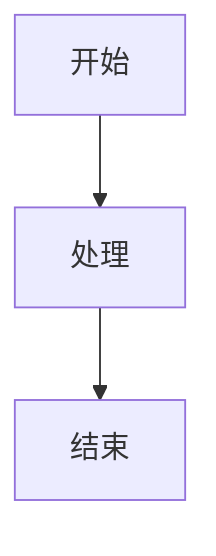

# Phaser.js 教程 PDF 生成系统

这是一个专为 Phaser.js 7天游戏开发教程设计的 PDF 生成系统，支持从 Markdown 文件生成高质量的 PDF 文档。

## 功能特性

### 🚀 核心功能
- **Markdown 到 PDF 转换**: 支持完整的 Markdown 语法和扩展功能
- **代码语法高亮**: 基于 highlight.js 的专业代码高亮
- **图表支持**: 内置 Mermaid 图表渲染
- **自动分页优化**: 智能的分页控制和内容布局

### 📖 文档功能
- **单文件生成**: 从单个 Markdown 文件生成 PDF
- **多文件合并**: 将多个 Markdown 文件合并为一个 PDF
- **教程专用模式**: 专为 Phaser.js 教程优化的生成模式
- **批量处理**: 支持配置文件批量生成

### 🎨 样式定制
- **专业模板**: 内置多种专业的 PDF 模板
- **响应式布局**: 自适应不同页面尺寸
- **自定义样式**: 支持自定义 CSS 样式
- **打印优化**: 专门优化的打印样式

### 🔧 技术特性
- **高性能**: 基于 Puppeteer 的高效渲染引擎
- **API 服务**: 提供 RESTful API 接口
- **命令行工具**: 完整的 CLI 工具支持
- **配置灵活**: 丰富的配置选项

## 快速开始

### 安装依赖

```bash
npm install
```

### 命令行使用

#### 单文件生成
```bash
npm run generate single input.md output.pdf --title "文档标题" --author "作者名称"
```

#### 多文件合并
```bash
npm run generate merge output.pdf --input file1.md file2.md file3.md --title "合并文档"
```

#### 教程生成
```bash
npm run generate tutorial ./tutorial-directory output.pdf
```

#### 批量生成
```bash
npm run generate batch config.json
```

### API 服务

启动 API 服务器：
```bash
npm run dev
```

服务器将运行在 http://localhost:3001

#### API 端点

**生成 PDF (POST /api/generate/markdown)**
```javascript
{
  "content": "# 标题\n\n内容...",
  "options": {
    "title": "文档标题",
    "author": "作者名称",
    "filename": "output.pdf"
  }
}
```

**从文件生成 (POST /api/generate/file)**
```javascript
{
  "filePath": "/path/to/file.md",
  "options": {
    "title": "文档标题",
    "filename": "output.pdf"
  }
}
```

**合并生成 (POST /api/generate/merge)**
```javascript
{
  "files": [
    "/path/to/file1.md",
    "/path/to/file2.md",
    {
      "content": "# 内容\n\n文本..."
    }
  ],
  "options": {
    "title": "合并文档",
    "filename": "merged.pdf"
  }
}
```

**教程生成 (POST /api/generate/tutorial)**
```javascript
{
  "tutorialDir": "/path/to/tutorial",
  "options": {
    "title": "Phaser.js 7天游戏开发教程",
    "author": "Phaser Tutorial Team",
    "version": "1.0.0",
    "filename": "tutorial.pdf"
  }
}
```

## 项目结构

```
pdf-generator/
├── src/
│   ├── generator.js           # 核心 PDF 生成器
│   ├── cli.js                # 命令行工具
│   ├── server.js             # API 服务器
│   ├── processors/           # 内容处理器
│   │   └── markdownProcessor.js
│   ├── templates/            # 模板引擎
│   │   └── templateEngine.js
│   └── styles/              # 样式管理
│       └── styleManager.js
├── templates/               # HTML 模板文件
├── styles/                 # CSS 样式文件
├── output/                 # 输出目录
├── temp/                   # 临时文件目录
├── package.json
└── README.md
```

## 配置选项

### PDF 生成选项

```javascript
{
  "format": "A4",              // 页面格式: A4, Letter, A3, A5
  "margin": {                  // 页边距
    "top": "2cm",
    "right": "2cm", 
    "bottom": "2cm",
    "left": "2cm"
  },
  "displayHeaderFooter": true, // 显示页眉页脚
  "printBackground": true,     // 打印背景
  "preferCSSPageSize": true    // 使用 CSS 页面尺寸
}
```

### 文档选项

```javascript
{
  "title": "文档标题",         // 文档标题
  "author": "作者名称",        // 作者
  "version": "1.0.0",         // 版本号
  "date": "2024-01-15",       // 日期
  "subtitle": "副标题",        // 副标题
  "description": "文档描述"    // 描述
}
```

## 高级功能

### 自定义模板

创建自定义 HTML 模板：

```html
<!-- templates/custom.html -->
<!DOCTYPE html>
<html>
<head>
    <title>{{title}}</title>
    <style>{{styles}}</style>
</head>
<body>
    <div class="document">
        <header>
            <h1>{{title}}</h1>
            {{#if author}}<p>作者: {{author}}</p>{{/if}}
        </header>
        <main>{{content}}</main>
    </div>
</body>
</html>
```

### 自定义样式

创建自定义 CSS 样式：

```css
/* styles/custom.css */
.document {
    font-family: "Times New Roman", serif;
    line-height: 1.8;
}

h1 {
    color: #2c3e50;
    border-bottom: 3px solid #3498db;
}

.code-block {
    background: #f8f9fa;
    border: 1px solid #e9ecef;
    border-radius: 8px;
}
```

### Markdown 扩展

支持的 Markdown 扩展功能：

#### 任务列表
```markdown
- [x] 已完成的任务
- [ ] 未完成的任务
```

#### 调用框
```markdown
> 💡 **提示**: 这是一个提示框
> ⚠️ **警告**: 这是一个警告框
> ❌ **危险**: 这是一个危险框
> ℹ️ **信息**: 这是一个信息框
```

#### 高亮文本
```markdown
==高亮文本==
```

#### 键盘按键
```markdown
按 [[Ctrl+C]] 复制
```

#### 分页符
```markdown
---page-break---
```

#### Mermaid 图表
```markdown

```

#### 文件包含
```markdown

```

## 批量配置

创建配置文件 `pdf-config.json`：

```json
{
  "options": {
    "format": "A4",
    "margin": {
      "top": "2cm",
      "right": "2cm",
      "bottom": "2cm", 
      "left": "2cm"
    },
    "displayHeaderFooter": true,
    "printBackground": true
  },
  "tasks": [
    {
      "type": "single",
      "input": "chapter1.md",
      "output": "output/chapter1.pdf",
      "options": {
        "title": "第一章",
        "author": "作者名称"
      }
    },
    {
      "type": "tutorial",
      "tutorialDir": "./tutorial",
      "output": "output/complete-tutorial.pdf",
      "options": {
        "title": "Phaser.js 完整教程",
        "author": "教程团队",
        "version": "1.0.0"
      }
    }
  ]
}
```

然后运行：
```bash
npm run generate batch pdf-config.json
```

## 性能优化

### 内存优化
- 使用流式处理大文件
- 及时清理临时文件
- 优化图片和资源加载

### 速度优化
- 复用浏览器实例
- 并行处理多个任务
- 缓存样式和模板

### 质量优化
- 高 DPI 渲染
- 矢量图形支持
- 字体嵌入

## 故障排除

### 常见问题

**1. 中文字体显示问题**
```css
/* 在自定义样式中添加中文字体 */
body {
    font-family: "PingFang SC", "Microsoft YaHei", sans-serif;
}
```

**2. 代码块分页问题**
```css
.code-block {
    page-break-inside: avoid;
    break-inside: avoid;
}
```

**3. 图片路径问题**
- 使用绝对路径或相对于 Markdown 文件的路径
- 确保图片文件存在且可访问

**4. 内存不足**
- 减少并发任务数量
- 增加系统内存
- 使用 `--max-old-space-size` 参数

### 调试模式

启用调试模式：
```bash
DEBUG=pdf-generator npm run generate single input.md output.pdf
```

## API 文档

完整的 API 文档可以通过以下方式访问：
- 启动服务器后访问 `/api/docs`
- 查看 `docs/api.md` 文件

## 许可证

本项目采用 MIT 许可证 - 查看 [LICENSE](LICENSE) 文件了解详情。

## 贡献

欢迎提交 Issue 和 Pull Request！

1. Fork 项目
2. 创建功能分支
3. 提交更改
4. 推送到分支
5. 创建 Pull Request

## 更新日志

### v1.0.0
- 初始版本发布
- 支持基础 Markdown 到 PDF 转换
- 提供 CLI 和 API 接口
- 内置多种模板和样式

## 联系方式

如有问题或建议，请通过以下方式联系：
- 提交 GitHub Issue
- 发送邮件到 [your-email@example.com]